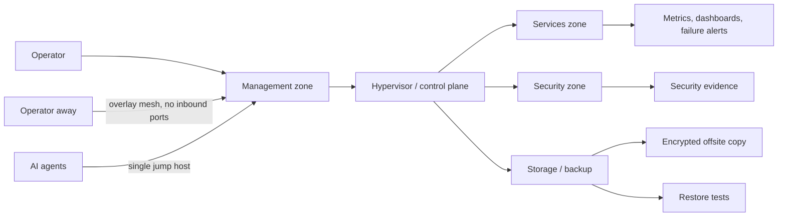

# Homelab Prod

<!-- MEMORY-UNIFICATION:portable:start -->
## Local continuity

The optional private local memory package contains context, decisions and offline continuity. It travels with a local checkout and is excluded from public history. It is independent of a central hub; reconnecting requires explicit reconciliation.
<!-- MEMORY-UNIFICATION:portable:end -->


> A sanitized infrastructure and security architecture record documenting segmentation, operations, observability, backup strategy and a risk-driven roadmap.

---

## What this documents

This is not a tool list. It documents how a small infrastructure environment, run by one person, is reasoned, operated and explained without exposing sensitive implementation details:

- a segmented platform on a single hypervisor, with explicit trust boundaries
- remote access through an overlay mesh with **no inbound ports** at the edge
- AI agents working through a single jump host with a manual switch and scoped privileged reading
- automatic, observed patching, and alerts that fire **only on failures**
- backups measured by the age of their **content**, an encrypted offsite copy and restore tests with measured RTO
- a self-hosted code remote with continuous integration
- architectural decisions, reverted decisions, residual risks and a roadmap
- real operational lessons, including our own mistakes, turned into sanitized case studies

The real environment is documented privately. This repository publishes the architecture reasoning, operational model and security posture at a sanitized level. **State described: September 2026.**

---

## Architecture story


```mermaid
flowchart LR
    OP[Operator] --> MGMT[Management zone]
    REM[Operator away] -->|overlay mesh, no inbound ports| MGMT
    AI[AI agents] -->|single jump host| MGMT
    MGMT --> HV[Hypervisor / control plane]
    HV --> APP[Services zone]
    HV --> SEC[Security zone]
    HV --> STO[Storage / backup]

    APP --> MON[Metrics, dashboards, failure alerts]
    SEC --> SIEM[Security evidence]
    STO --> OFF[Encrypted offsite copy]
    STO --> DR[Restore tests]
```

---

## Reading map

### English
- [00 - Executive architecture](docs/en/00-executive-architecture.md)
- [01 - Executive summary](docs/en/01-executive-summary.md)
- [02 - Architecture and network](docs/en/02-architecture-and-network.md)
- [03 - Security and access](docs/en/03-security-and-access.md)
- [04 - Operations runbook](docs/en/04-operations-runbook.md)
- [05 - Backup and recovery](docs/en/05-backup-and-recovery.md)
- [06 - Observability and roadmap](docs/en/06-observability-and-roadmap.md)
- [07 - Architecture decisions](docs/en/07-architecture-decisions.md)
- [Case studies](docs/en/case-studies/README.md)

### Espanol
- [00 - Arquitectura ejecutiva](docs/es/00-arquitectura-ejecutiva.md)
- [01 - Resumen ejecutivo](docs/es/01-resumen-ejecutivo.md)
- [02 - Arquitectura y red](docs/es/02-arquitectura-y-red.md)
- [03 - Seguridad y accesos](docs/es/03-seguridad-y-accesos.md)
- [04 - Runbook operativo](docs/es/04-runbook-operativo.md)
- [05 - Backup y recuperacion](docs/es/05-backup-y-recuperacion.md)
- [06 - Observabilidad y roadmap](docs/es/06-observabilidad-y-roadmap.md)
- [07 - Decisiones arquitectonicas](docs/es/07-decisiones-arquitectonicas.md)
- [Casos de estudio](docs/es/casos-de-estudio/README.md)

---

## What is intentionally private

This repository does not publish:

- real IP addresses, hostnames or users
- credentials, tokens, keys or webhooks
- complete firewall, VPN, SIEM or backup configurations
- raw logs, screenshots or alert payloads
- exact rollback paths, scripts or operational evidence
- private incident records

That omission is part of the security model, not a documentation gap.

---

## Repository structure

```text
homelab/
├── README.md
├── LICENSE.md
└── docs/
    ├── en/
    │   ├── 00-executive-architecture.md
    │   ├── 01-executive-summary.md
    │   ├── 02-architecture-and-network.md
    │   ├── 03-security-and-access.md
    │   ├── 04-operations-runbook.md
    │   ├── 05-backup-and-recovery.md
    │   ├── 06-observability-and-roadmap.md
    │   ├── 07-architecture-decisions.md
    │   └── case-studies/
    └── es/
        ├── 00-arquitectura-ejecutiva.md
        ├── 01-resumen-ejecutivo.md
        ├── 02-arquitectura-y-red.md
        ├── 03-seguridad-y-accesos.md
        ├── 04-runbook-operativo.md
        ├── 05-backup-y-recuperacion.md
        ├── 06-observabilidad-y-roadmap.md
        ├── 07-decisiones-arquitectonicas.md
        └── casos-de-estudio/  # 01-08
```
