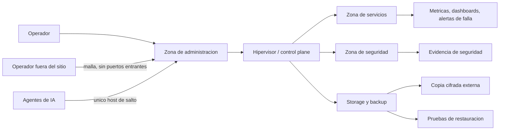

# Homelab Prod

> Infraestructura productiva de una sola persona: chica en escala, completa en piezas, encendida 24/7.

**No es un laboratorio de prueba: es infraestructura productiva.** No tiene la
escala de una empresa, pero tiene todas sus piezas -virtualizacion, red
segmentada, DNS, almacenamiento, backups con copia externa, monitoreo, SIEM,
acceso remoto, aplicaciones en uso y un remoto de codigo propio- y funciona
24/7 sobre un hipervisor de tipo 1 en un servidor dedicado. Cuando algo falla,
el impacto es real.

Este repositorio es **la vista completa**. Cada area tiene ademas su propio
repo, con el detalle, las cifras y los casos (ver [La serie](#la-serie)).

## En 30 segundos

| Indicador | Resultado |
|---|---|
| Puertos entrantes abiertos en el borde | **0** |
| Intentos no autorizados frenados por la politica de acceso en un solo incidente | **13.017** en 34 horas |
| Verificaciones automaticas que informaban algo falso, detectadas y corregidas | **7** en una semana |
| Respaldo congelado que la metrica daba por sano, detectado y corregido | **casi 4 meses** |
| Recuperacion medida en pruebas de restauracion | **segundos** a **menos de 2 minutos** |
| Casos reales documentados, con lo que salio mal | **8** |

## Escala chica, exigencia de produccion

| Pieza | Con que | Si falla |
|---|---|---|
| Virtualizacion | Proxmox VE, hipervisor de tipo 1; una maquina por funcion | cae todo lo demas |
| DNS interno | Pi-hole, resolucion para todos los equipos y servicios | todo parece caido aunque este sano |
| Red y acceso remoto | zonas por funcion; Tailscale sin puertos abiertos, politica por puerto | se pierde el aislamiento o el acceso desde afuera |
| Almacenamiento y backups | OpenMediaVault, backups nocturnos, copia cifrada externa, pruebas de restauracion | se pierde la capacidad de recuperar |
| Monitoreo y seguridad | Prometheus, Grafana, Wazuh y alertas al telefono | los incidentes pasan sin que nadie se entere |
| Aplicaciones propias | Docker detras de Nginx Proxy Manager; una envia correo real | se frena trabajo real |
| Codigo | Forgejo privado con integracion continua | no hay donde versionar ni desde donde desplegar |

Lo mismo que en una empresa, en chico: cambios con plan y rollback, evidencia,
alertas que avisan solas y controles que se prueban haciendolos fallar.

## En vivo

_Capturas reales del entorno, con nombres, direcciones, usuarios y versiones reemplazados por su funcion._

Tablero propio de operaciones: estado, parches, salud, backups, seguridad, red y desarrollo en una sola pantalla.

Proxmox VE: nueve maquinas, una por funcion, con 12 dias de uptime.

Grafana: 13 exporters y 25 sondas de disponibilidad, cero caidas.

15 contenedores en produccion con su consumo en tiempo real.

Forgejo: todo el codigo vive en un remoto propio y privado.

Integracion continua: cada commit corre los tests.

## Arquitectura

```mermaid
flowchart LR
    OP[Operador] --> MGMT[Zona de administracion]
    REM[Operador fuera del sitio] -->|malla, sin puertos entrantes| MGMT
    AI[Agentes de IA] -->|unico host de salto| MGMT
    MGMT --> HV[Hipervisor / control plane]
    HV --> APP[Zona de servicios]
    HV --> SEC[Zona de seguridad]
    HV --> STO[Storage y backup]
    APP --> MON[Metricas, dashboards, alertas de falla]
    SEC --> SIEM[Evidencia de seguridad]
    STO --> OFF[Copia cifrada externa]
    STO --> DR[Pruebas de restauracion]
```

## Problema, decision, resultado

| Problema | Por que importaba | Que se hizo | Resultado |
|---|---|---|---|
| El acceso remoto exigia abrir un puerto en el borde | todo el resto del diseno evita exponer el borde | malla con identidad por nodo y politica por puerto | 0 puertos entrantes; 13.017 intentos no permitidos frenados |
| Un agente de IA con claves en la estacion del operador era, en la practica, el operador | no se podia cortar ni auditar por separado | un unico host de salto con interruptor manual | el agente **no puede**, en vez de **no debe** |
| Un respaldo llevaba casi 4 meses congelado y la metrica decia "horas" | se habria restaurado algo viejo creyendo que era de ayer | medir la edad del contenido, no la del archivo | ya no puede informar exito sobre datos viejos |
| Siete verificaciones informaban algo falso | un control que miente da confianza sin proteger | verificar el efecto, y lo que tiene que fallar | practica aplicada a todo script de seguridad |
| La configuracion decia que todo arrancaba solo despues de un reboot | un reboot real lo desmintio para 2 maquinas | reboot real como prueba, confirmado por kernel y hora de arranque | riesgo documentado, no escondido |

## La serie

| Repo | De que trata | Dato clave |
|---|---|---|
| [Zero Trust Remote Access](https://github.com/Nicolasperaltait/zero-trust-remote-access) | acceso remoto sin puertos abiertos y agentes de IA con minimo privilegio | 0 puertos entrantes |
| [Network Segmentation Playbook](https://github.com/Nicolasperaltait/network-segmentation-playbook) | segmentacion por funcion, DNS interno y que se filtro, que no y que se previno | 13.017 intentos frenados |
| [Alerts That Matter](https://github.com/Nicolasperaltait/alerts-that-matter) | alertas, SIEM y controles que se verifican por su efecto | 7 controles que mentian |
| [Backups That Don't Lie](https://github.com/Nicolasperaltait/backups-that-dont-lie) | backups medidos por su contenido y restauracion probada | RTO de segundos |
| [Hypervisor as Control Plane](https://github.com/Nicolasperaltait/hypervisor-as-control-plane) | el hipervisor operado como plataforma productiva | reboot verificado, no supuesto |

## Casos de estudio

| Caso | Que muestra |
|---|---|
| [01 - Presion de storage y postura de recuperacion](docs/es/casos-de-estudio/01-presion-storage-y-recuperacion.md) | recuperar vale mas que tener copias |
| [02 - Monitoreo bloqueado por segmentacion](docs/es/casos-de-estudio/02-monitoreo-bloqueado-por-segmentacion.md) | excepciones minimas y documentadas |
| [03 - Eventos de backup como evidencia SIEM](docs/es/casos-de-estudio/03-eventos-backup-como-evidencia-siem.md) | seguridad conectada con riesgo operativo |
| [04 - Migracion de storage y reboot controlado](docs/es/casos-de-estudio/04-migracion-storage-observabilidad-y-reboot-controlado.md) | cambios sensibles con rollback y evidencia |
| [05 - Acceso de agentes de IA con minimo privilegio](docs/es/casos-de-estudio/05-acceso-de-agentes-de-ia-y-minimo-privilegio.md) | el control en la infraestructura, no en la conducta |
| [06 - Cuando un control no mide lo que dice medir](docs/es/casos-de-estudio/06-cuando-un-control-no-mide-lo-que-dice-medir.md) | verificar el efecto, no la accion |
| [07 - Migracion de la workstation y respaldos que mentian](docs/es/casos-de-estudio/07-migracion-de-workstation-y-respaldos-que-mentian.md) | un plan no probado es una hipotesis |
| [08 - Ordenar un NAS que nadie usaba](docs/es/casos-de-estudio/08-ordenar-un-nas-que-nadie-usaba.md) | probar desde donde prueba el usuario |

## Documentacion

| | Espanol | English |
|---|---|---|
| Arquitectura ejecutiva | [00](docs/es/00-arquitectura-ejecutiva.md) | [00](docs/en/00-executive-architecture.md) |
| Resumen ejecutivo | [01](docs/es/01-resumen-ejecutivo.md) | [01](docs/en/01-executive-summary.md) |
| Arquitectura y red | [02](docs/es/02-arquitectura-y-red.md) | [02](docs/en/02-architecture-and-network.md) |
| Seguridad y accesos | [03](docs/es/03-seguridad-y-accesos.md) | [03](docs/en/03-security-and-access.md) |
| Runbook operativo | [04](docs/es/04-runbook-operativo.md) | [04](docs/en/04-operations-runbook.md) |
| Backup y recuperacion | [05](docs/es/05-backup-y-recuperacion.md) | [05](docs/en/05-backup-and-recovery.md) |
| Observabilidad y roadmap | [06](docs/es/06-observabilidad-y-roadmap.md) | [06](docs/en/06-observability-and-roadmap.md) |
| Decisiones arquitectonicas | [07](docs/es/07-decisiones-arquitectonicas.md) | [07](docs/en/07-architecture-decisions.md) |
| Casos de estudio | [indice](docs/es/casos-de-estudio/README.md) | [index](docs/en/case-studies/README.md) |

## In English

**Not a test lab: production infrastructure.** Small in scale, complete in
parts -virtualization, segmented network, DNS, storage, backups with an offsite
copy, monitoring, SIEM, remote access, applications in real use and a private
code remote- running 24/7 on a type-1 hypervisor (Proxmox VE) on a dedicated
server. Same rules as an enterprise environment, at small scale: planned
changes with rollback, evidence, alerts that fire on their own and controls
tested by making them fail. Full documentation in [English](docs/en/01-executive-summary.md).

## Que no se publica, y por que

IPs, nombres de host, dominios, usuarios, versiones exactas, credenciales,
configuraciones completas, registros crudos y rutas de rollback. **La omision
es parte del modelo de seguridad**, no una falta de documentacion. La
documentacion operativa completa es privada.

## Licencia

Ver [LICENSE.md](LICENSE.md).
