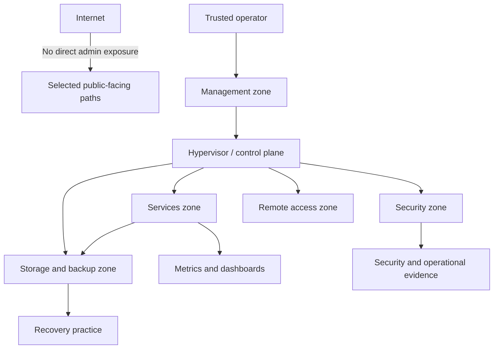

# 00 - Executive Architecture

## Problem

A homelab can easily become a collection of tools without an operating model. This project treats the environment as a small infrastructure platform with security boundaries, operational evidence and recovery expectations.

The design problem is:

> how to run a realistic internal platform without turning it into an unmanaged, overexposed or undocumented environment.

## Target architecture

The environment is organized around functional zones:

- management and control plane
- internal services
- security monitoring
- storage and backup
- remote access
- observability

## Key decisions

| Decision | Why it matters |
|---|---|
| Treat the hypervisor as a control plane | it is not only compute; it anchors segmentation, transit and recovery |
| Keep administrative surfaces private | reduces exposure and keeps trust boundaries understandable |
| Centralize internal DNS | makes service access consistent and exposes DNS as a managed dependency |
| Separate monitoring from security visibility | metrics and security evidence answer different questions |
| Keep backup design recovery-oriented | backup presence is not enough without restore confidence |
| Publish only sanitized documentation | technical clarity without leaking implementation details |

## Tradeoffs

| Tradeoff | Position |
|---|---|
| Simplicity vs. feature count | prefer fewer components with clear roles |
| Segmentation vs. operational convenience | allow cross-zone flows only when justified |
| Public detail vs. security | publish reasoning, not exact implementation |
| Dashboard richness vs. signal quality | prefer actionable status over visual noise |
| Backup automation vs. recovery proof | automation helps, restore testing decides confidence |

## Controls

- segmentation by functional role
- controlled administrative access
- internal naming and DNS discipline
- offsite backup strategy documented as a recovery control
- operational runbook and diagnostic order
- SIEM-oriented evidence for critical events
- private evidence repository separated from public documentation

## Residual risks

| Risk | Why it remains relevant |
|---|---|
| Restore confidence | a system is not mature until restore is tested and documented |
| DNS dependency | centralized DNS simplifies operations but remains a key dependency |
| Remote access constraints | upstream networking affects the final design |
| Alert noise | alerting must stay selective to remain useful |
| Storage resilience | backup strategy still depends on storage health and recovery paths |

## Roadmap

1. Formal restore testing.
2. Cleaner alert routing and escalation.
3. SIEM-backed operational evidence.
4. DNS redundancy.
5. Role-aware hardening v2.
6. More executive architecture diagrams and case studies.

## Architecture reading

This project should be read as an architecture and operations record:

- boundaries and dependencies are explicit
- tradeoffs and residual risks are documented
- backup is treated as recovery, not file generation
- public documentation is separated from private operational evidence
- each component has a documented reason to exist
