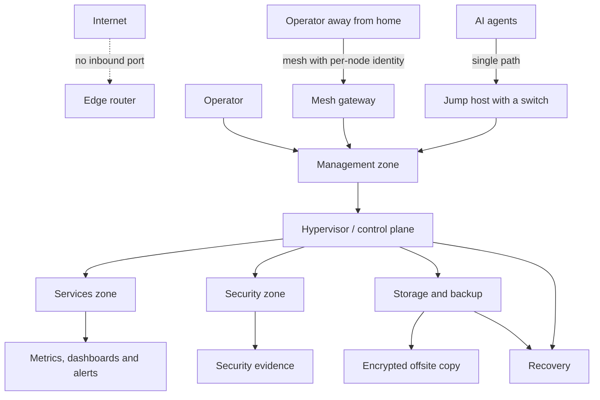

# 00 - Executive Architecture

> State described: September 2026.

## Problem

A homelab easily becomes a collection of tools with no operating model. This
project treats the environment as a small infrastructure platform, with security
boundaries, operational evidence and recovery expectations, run by a single
person.

The design problem is:

> how to operate a realistic internal platform without turning it into a messy,
> overexposed or unexplainable environment.

## Current architecture

The environment is organized into functional zones, all anchored on a single
hypervisor:

- management and control plane
- internal services and in-house applications
- security monitoring
- storage, backup and recovery
- remote access through an overlay mesh, **with no inbound ports**
- automated and AI-agent access, through a single jump host
- observability and alerting

```mermaid
flowchart TB
    Internet[Internet] -.->|no inbound port| Edge[Edge router]
    Operator[Operator] --> Mgmt[Management zone]
    Remote[Operator away from home] -->|mesh with per-node identity| Gw[Mesh gateway]
    Gw --> Mgmt
    Agent[AI agents] -->|single path| Jump[Jump host with a switch]
    Jump --> Mgmt

    Mgmt --> HV[Hypervisor / control plane]
    HV --> Services[Services zone]
    HV --> Security[Security zone]
    HV --> Storage[Storage and backup]
    HV --> DR[Recovery]

    Services --> Obs[Metrics, dashboards and alerts]
    Security --> Evidence[Security evidence]
    Storage --> Offsite[Encrypted offsite copy]
    Storage --> DR
```

## Key decisions

| Decision | Why it matters |
|---|---|
| Treat the hypervisor as control plane | it is not just compute: it anchors segmentation, transit and recovery |
| Remote access with no inbound ports | the previous model required opening the edge, which the rest of the design avoids |
| A single path for automation | turning off agent access must not turn off the operator's |
| Centralize internal DNS | consistent access by name, at the cost of a managed dependency |
| Separate metrics from security evidence | they answer different questions |
| Alert only on failures | a channel full of confirmations teaches you to ignore it |
| Measure backups by their content | a recent archive does not prove it holds new data |
| Own code remote | work history does not depend on an external service |
| Publish only sanitized documentation | technical clarity without leaking implementation |

## Tradeoffs

| Tradeoff | Position |
|---|---|
| Simplicity vs. number of services | fewer components with clear roles; several unused ones were retired |
| Segmentation vs. convenience | cross-zone flows only when justified and documented |
| Automate vs. observe | every automated task leaves a metric that shows when it stopped running |
| Public detail vs. security | publish reasoning, not exact implementation |
| Automatic patching vs. stability | security patches only, never automatic reboot |

## Controls

- segmentation by function on the hypervisor
- remote access with policy as code and default deny
- key-only authentication on infrastructure hosts
- scoped privileged reading for automation, with no generic permissions
- system auditing on infrastructure hosts
- automatic, observed security patching
- backups with a content metric, encrypted offsite copy and restore tests
- failure alerts to a messaging channel
- deletions through quarantine with prior verification

## Residual risks

| Risk | Why it still matters |
|---|---|
| Hypervisor dependency | a single host concentrates compute, transit and recovery |
| DNS with a single resolver | if it fails, many services look down |
| Storage resilience | a support disk failed and its replacement is postponed |
| VM-level backup coverage | not every machine has an image backup, only data backup |
| Restore tests | they exist and worked, but their automatic run is interrupted |
| Per-host network filtering | applied on most hosts, not all |

## Reading the architecture

This project should be read as an architecture and operations record:

- explicit boundaries and dependencies
- documented tradeoffs and residual risks, including the open ones
- backup treated as recovery, not as file generation
- public documentation separated from private operational evidence
- every component has a documented reason to exist, and those that lost it
  were retired
