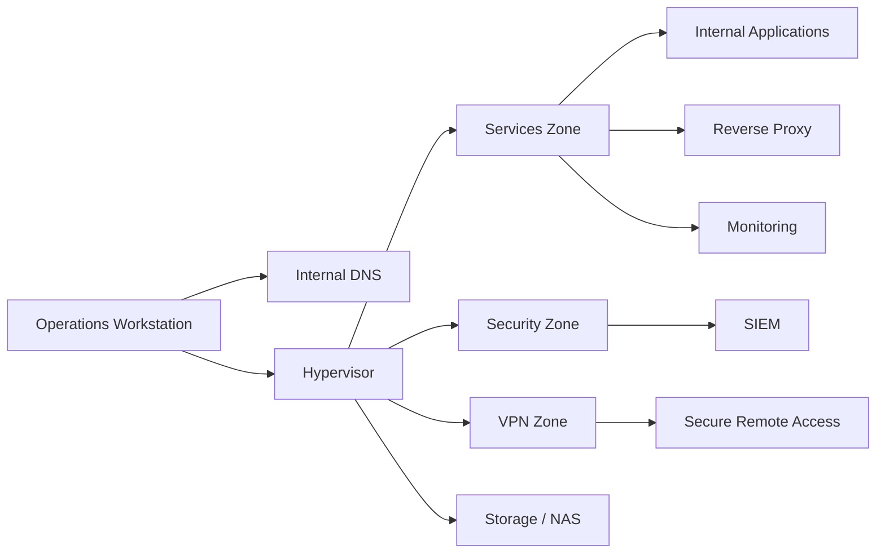

# 01 - Executive Summary

## Objective

This document summarizes the homelab from an executive and technical perspective. The public version is designed to show architecture, operations, security and recovery judgment without exposing sensitive implementation details.

## Overview

The homelab was designed as a practical environment for infrastructure, cybersecurity and daily operations. The goal is not to accumulate services, but to demonstrate the ability to:

- design a segmented architecture
- operate services with discipline
- reduce unnecessary exposure
- centralize internal resolution
- observe the environment with useful dashboards
- back up and recover critical components
- document decisions, incidents and limits

## Public / private split

| Layer | Purpose |
|---|---|
| Private documentation | real operations, evidence, incidents, paths, scripts, errors and critical data |
| Public repository | sanitized version for technical explanation and architecture review |

Real operational information is not copied directly into the public repository. It is transformed first into patterns, decisions and lessons without identifiable details.

## What this project demonstrates

| Capability | How it appears in the repo |
|---|---|
| Architecture | zones, dependencies and controlled publication |
| Operations | runbook, periodic checks and scenario-based troubleshooting |
| Security | least privilege, private admin surfaces and role-aware hardening |
| Observability | separation between operational metrics and security visibility |
| Continuity | backup model, offsite strategy and recovery as a maturity milestone |
| Technical communication | clear, sanitized and defensible documentation |

## Main components

| Layer | Function |
|---|---|
| Hypervisor | virtualization, transit between segments and central control point |
| Internal DNS | centralized resolution and consistent access |
| Application platform | host for internal services |
| Security | SIEM and event telemetry |
| Monitoring | metrics, dashboards and operational visibility |
| Storage | data repository and backup target |
| Remote access | secure access design under a VPN model |

## Current state

### Solved

- logical segmentation by zones
- centralized internal DNS
- operational application platform
- baseline observability
- documented and validated backup strategy and offsite recovery model (backup window confirmed across multiple consecutive cycles with automated evidence)
- SIEM agent inventory completed; decommissioned hosts removed from the manager
- NOC display node operational: internal DNS resolution and kiosk mode validated
- operational access profiles standardized by role (admin / operator)
- operational dashboard approach
- public documentation separated from private documentation

### Maturing

- formal restore tests (active critical path)
- more actionable operational alerts (Discord / notifications)
- SIEM evidence for critical backup events
- DNS redundancy
- remote access improvements under connectivity constraints
- role-aware hardening v2

## Simplified logical topology

## Canonical project state

| Area | Status |
|---|---|
| Architecture | stable and documented |
| Baseline security | applied with a role-aware approach |
| Observability | functional and improving |
| Backups | operational, documented and validated with automated evidence |
| Recovery | window validated; formal restore test pending (active critical path) |
| Public documentation | sanitized and technically defensible |

## Correct reading

This homelab is not trying to look enterprise through decoration. It is trying to show something more serious:

> a small, reasoned, operable and explainable infrastructure.
