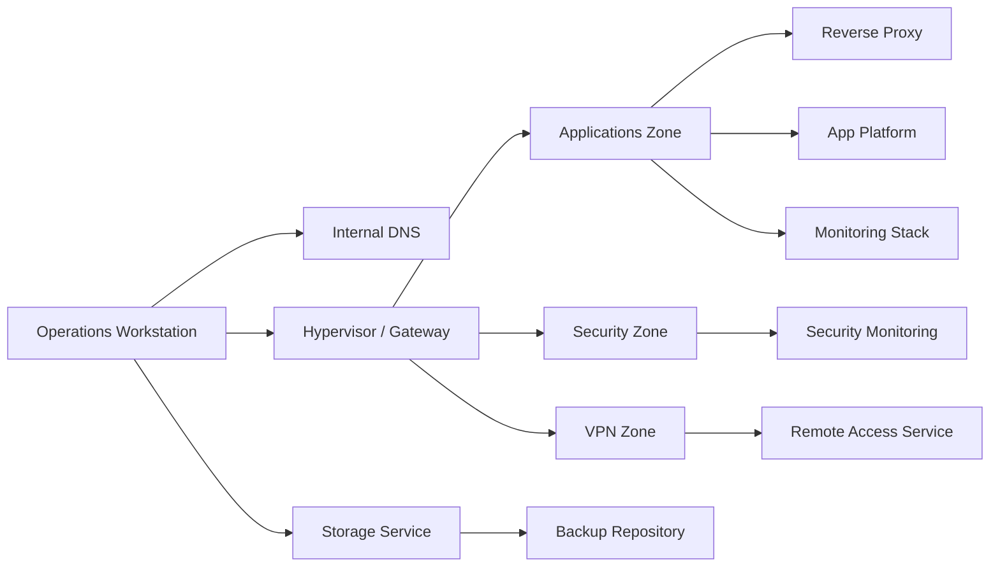
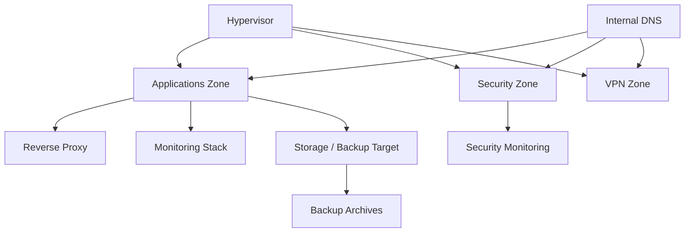

# 02 — Architecture and Network

## Architecture goals

The architecture is designed around five priorities:

1. security
2. simplicity
3. observability
4. service isolation
5. maintainable growth

---

## High-level topology

---

## Sanitized zone model

| Zone | Example sanitized range | Purpose |
|---|---|---|
| Management / LAN | 192.168.10.0/24 | local admin access, DNS, NAS, hypervisor management |
| Applications | 10.20.10.0/24 | internal applications and reverse proxy |
| Security | 10.20.30.0/24 | SIEM and security telemetry |
| VPN | 10.20.40.0/24 | remote access entry model |

---

## Logical service map

| Service role | Platform family | Zone | Purpose |
|---|---|---|---|
| Hypervisor | [hipervisor sanitizado] | Management | compute, gateway, segmentation control |
| Internal DNS | [resolver DNS interno sanitizado] | Management | name resolution and DNS filtering |
| Storage / NAS | [solucion NAS sanitizada] | Management | backup target and shared storage |
| App platform | Linux VM + [runtime de contenedores sanitizado] | Applications | self-hosted services |
| Reverse proxy | [reverse proxy sanitizado] | Applications | controlled internal publication |
| Security monitoring | [plataforma SIEM sanitizada] | Security | event collection and visibility |
| Metrics and dashboards | [TSDB y capa de dashboards sanitizadas] | Applications | observability |
| VPN | [servicio VPN sanitizado] | VPN | secure remote access model |

---

## Dependency model

---

## Connectivity philosophy

The environment does **not** assume free east-west traffic.  
Instead, the intended model is:

- allow the admin workstation to reach all required systems
- restrict lateral traffic unless justified
- document legitimate cross-zone flows
- prefer internal name resolution over ad-hoc access patterns
- avoid direct Internet exposure of admin interfaces

---

## Example legitimate cross-zone flows

| Source zone | Destination zone | Why it exists |
|---|---|---|
| Management | All zones | administration and validation |
| Applications | Security | service publication or telemetry workflows |
| Applications | Management / Storage | backup or file workflow integration |
| VPN | Management and selected services | secure remote administrative access |

---

## Why the hypervisor matters so much

The virtualization host is not just “where VMs run.”

It is also:

- the segmentation anchor
- the gateway between internal zones
- a critical dependency for routing/NAT behavior
- a major recovery pivot

That makes it one of the most operationally sensitive parts of the environment.

---

## Why this architecture is still intentionally small

This is not a complexity contest.

The environment is intentionally limited so that each layer remains:

- understandable
- testable
- supportable by one operator
- explainable in public documentation

---

## Architectural strengths

- clean role separation
- low ambiguity in service purpose
- strong fit for portfolio explanation
- practical rather than decorative complexity
- room to grow without redesigning from scratch

---

## Architectural risks still tracked

| Risk | Why it matters |
|---|---|
| DNS remains critical | many failures look like “service outage” when they are resolution problems |
| Hypervisor is a control-plane dependency | segmentation and VM availability depend on it |
| Restore confidence must be proven | backup presence is not the same as recovery readiness |
| Remote access design is constrained by upstream networking | VPN design quality depends on the external connectivity model |

---

## Summary

The architecture is strong because it is **coherent**.  
Every major service exists for a reason, belongs to a role, and supports a visible operational outcome.
