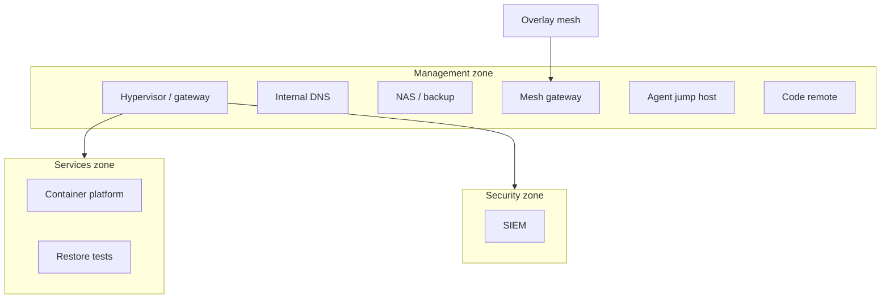

# 02 - Architecture and Network

> State described: September 2026.

## Purpose

Describe the homelab architecture in a clear, sanitized way.

## Design principles

- segment by function
- avoid unnecessary lateral movement
- centralize administration
- no inbound port at the edge
- prioritize traceability and maintainability
- grow in layers, not by improvisation, and retire what stops being used

## Logical zones

| Zone | Purpose |
|---|---|
| Management | hypervisor, DNS, NAS, code remote, mesh gateway and jump host |
| Services | containers, in-house applications, observability, proxy and the restore test machine |
| Security | SIEM and telemetry |

**The remote access zone was retired.** It existed for a point-to-point tunnel
that required an inbound port. Current remote access is not a network zone: it
is a layer on top of the addressing. See [03 - Security and access](03-security-and-access.md).

## Logical network model

```mermaid
flowchart TB
    subgraph ADM[Management zone]
        HV[Hypervisor / gateway]
        DNS[Internal DNS]
        NAS[NAS / backup]
        GW[Mesh gateway]
        JMP[Agent jump host]
        GIT[Code remote]
    end
    subgraph SRV[Services zone]
        CT[Container platform]
        DR[Restore tests]
    end
    subgraph SEC[Security zone]
        SIEM[SIEM]
    end
    HV --> SRV
    HV --> SEC
    MESH[Overlay mesh] --> GW
```

## Architectural reasoning

The home physical network is not designed for advanced segmentation, so
isolation is implemented on the hypervisor. That makes it doubly critical:

- compute platform
- transit, NAT and control point between zones

## Services by function

| Function | Technology family (conceptual) | Role in the design |
|---|---|---|
| Virtualization | open-source hypervisor | main host and transit core |
| Internal DNS | filtering resolver | internal resolution, served by DHCP to the whole network |
| App platform | container runtime on a VM | in-house applications and internal services |
| Proxy | managed reverse proxy | internal publication of web services |
| Code remote | self-hosted git forge with CI | own repositories and pipelines |
| SIEM | open-source SIEM platform | events, agents and evidence |
| Monitoring | metrics TSDB + dashboard and alerting layer | health, freshness and notifications |
| NAS | open-source NAS solution | backups, workstation mirror and offsite copy |
| Recovery | dedicated VM in the services zone | ephemeral test restores, in an instance that is never published |
| Remote access | overlay mesh with per-node identity | access with no inbound ports |
| Automated access | jump VM | single path for AI agents |

## First-order dependencies

| Component | Reason |
|---|---|
| Hypervisor | concentrates virtualization, transit and recovery |
| Internal DNS | if it fails, many services look down |
| Storage | affects backups, retention and recovery |
| Container platform | concentrates apps, proxy and observability |
| Mesh gateway | it is the only access from outside home |

## Boot order

Machines start in dependency order: DNS first, then the mesh gateway and
storage, then the container platform. A real hypervisor reboot showed that **the
staged startup stopped before reaching the last two machines**, even though the
configuration said they should start. Read on its own, the configuration looked
solved; the reboot showed it was not. It remains an open risk until the cause is
confirmed.

## Service publication

- direct, controlled administrative access
- internal services by name, through the proxy
- in-house applications reachable only by tunnel, never published
- no external exposure

## Naming convention

Internal names by role, domains separated by zone and understandable aliases for
critical services. The real naming is not published in this repository.

## Reading the architecture

This architecture does not compete on complexity. It competes on clarity:

- every zone has a purpose
- every service has a reason
- every important dependency is explicit
- what stopped having a reason was retired: a VPN tunnel, a NOC console, a chat
  alert channel and several local AI services
