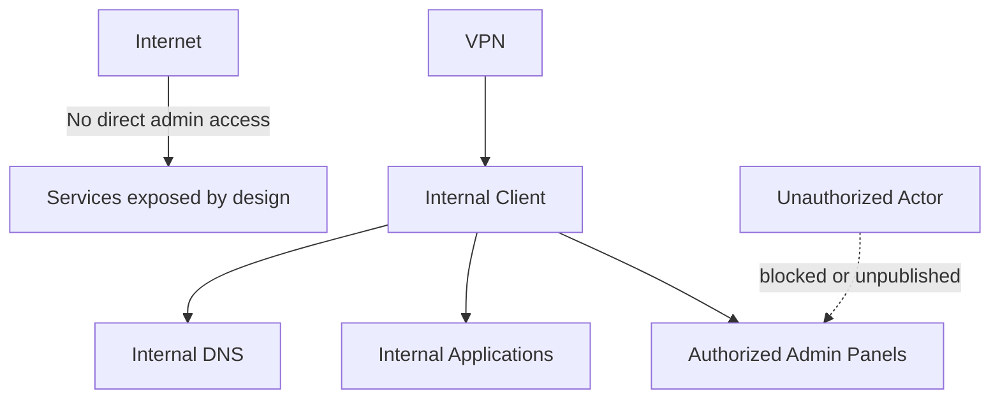

# 03 - Security and Access

## Purpose

Document the homelab security approach without exposing sensitive details.

## Security model

The environment follows a small but explicit model:

- segmentation by role
- least privilege
- reduced lateral movement
- administrative access not publicly exposed
- remote access through an overlay mesh, with no inbound ports
- documented exceptions when cross-zone flows are required
- separation between private and public documentation

## Security design principles

| Principle | Meaning in practice |
|---|---|
| Least privilege | controlled administrative access |
| Segmentation by role | zones separated by purpose |
| Security by design | critical services are not directly exposed |
| Documented exceptions | allowed flows exist only for functional reasons |
| Role-aware hardening | different host roles need different controls |
| Public sanitization | publish intent and reasoning, not sensitive implementation |

## What is not published

- private keys
- secrets
- tokens
- credentials
- real administrative endpoints
- complete VPN configuration
- internal backup or log paths
- complete firewall, SIEM or monitoring configuration
- sensitive offsite backup details

## Access model

### Administrative access

- direct access only from authorized sources
- SSH and internal panels kept under control
- no direct public exposure of administrative interfaces

### Application access

- preference for internal naming
- reverse proxy for selected web services
- direct ports only when operationally justified

### Remote access

**The model changed in 2026, and the change matters, so it is documented rather
than rewritten.**

| Before | Now |
|---|---|
| Point-to-point tunnel with a self-hosted concentrator | **Overlay mesh with per-node identity** |
| Required **one inbound port published** on the edge router | **No inbound ports.** Each node dials out to the control plane |
| A network zone dedicated to remote access | The mesh **is not a zone**: it is a layer above addressing |
| Implicit authorisation: whoever enters the tunnel enters the network | **Policy as code**: which node reaches which destination, on which port |

**Why it changed:** the previous model forced an open port at the edge, which is
exactly what the rest of the design avoids. The concentrator was powered off,
with a rollback point, and **its network segment stopped being advertised**.

Decisions specific to the new model:

- **per-host routes are advertised instead of the whole subnet.** Advertising the
  whole subnet makes the environment unreachable from any foreign network using
  the same private range, which is the common case. With per-host routes, the
  mesh route wins on specificity;
- **the home gateway is not advertised**, by explicit decision;
- one node acts as an internet egress for untrusted networks;
- **the advertised route list is replaced wholesale on every change**, and the
  internet egress lives inside that same list: re-advertising without including
  it disables egress **with no error and no alert**. It happened once and is now
  a written warning;
- external publication only by explicit design;
- upstream networking constraints are considered part of the design.

## Role-aware hardening

A key lesson from the project is that generic hardening does not fit every host.

| Host type | Recommended approach |
|---|---|
| Internal DNS | allow functional resolver ports and minimal administration |
| NAS / storage | protect shares and panels by source |
| SIEM | expose only required dashboard and agent ports |
| Container host | special handling for bridge networking and proxy behavior |
| Hypervisor | careful control of firewall, forwarding and transit |

## Legitimate cross-zone flows

Some zones need to communicate with others. That does not contradict segmentation; it makes it realistic.

Criteria:

- allow only the required flow
- document why it exists
- validate operational impact
- review it periodically
- do not publish real source/destination rules

## Security as operational evidence

The SIEM is not used only as a dashboard. Its expected role is to retain relevant operational and security events, such as:

- backup failures
- changes to critical components
- disconnected agents
- relevant authentication events
- alerts requiring human action

The public version describes the pattern, not the real rules or raw events.

## Known risks

| Risk | Current mitigation | Pending work |
|---|---|---|
| DNS single point of failure | centralized internal DNS | DNS redundancy |
| Remote access limited by connectivity | local VPN design | relay or upstream improvement |
| Recovery not fully proven | backups and DRP documented | real restore test |
| Noisy alerting | actionable-alert criteria | continuous refinement |
| Growing complexity | runbook and documentation | continuous scope review |

## Threat model lite

## Core idea

Security in this homelab is not based on a single tool. It is based on a combination of:

- segmentation
- controlled publication
- role-aware hardening
- disciplined operations
- security observability
- clear and safe documentation

---

## Automation and AI agent access

Accounts that operate automatically -including an AI assistant- **do not share
the operator's access model**. The criterion is that switching off automated
access must not switch off the operator's, and the other way around.

| Property | How it is solved |
|---|---|
| A single path | All automated access goes through a dedicated jump host. There is no direct access to destinations |
| Physical off switch | That host **does not start on its own**. The operator powers it on from the hypervisor, outside the agent's reach |
| Confined credentials | Credentials for the rest of the estate live **only inside** the jump host |
| Source restriction | Even if leaked, a credential is useless from elsewhere |
| No forwarding | The jump host allows neither port nor agent forwarding: with forwarding, the credential would effectively be back on the operator's workstation |
| Per-account traceability | Events reach the SIEM immediately, distinguishing which account did what |
| No emergency path | Explicit decision. If the jump host is off, ask for it to be powered on |

### Privileged reading without write access

Most of an automation account's useful work is **reading**. A permission list
scoped to specific commands creates constant friction over harmless operations,
and the easy way out -authorising a generic reader with privilege- is
**equivalent to granting full access**, because it can read the password file.

This is solved with a purpose-built read-only wrapper with a deny list for
critical material, which **normalises paths** before deciding and **inspects
content** instead of trusting the file name.

### Permissions are sized by measurement

The list of allowed privileged commands **is not designed in the abstract**: it
comes from reading what was actually invoked. In the 2026 review that exercise
showed a broad permission granted "just in case" **had never been needed**: most
use was reading, some of it required no privilege at all, and two concrete
actions remained.

**A rule the agent follows voluntarily is not a control.** If a permission is not
used, there is no reason for it to exist.

Detail in [Case 05](case-studies/05-ai-agent-access-under-least-privilege.md).

---

## Control verification

A control that is never tested is a documented assumption.

The practice in this environment is that **every security script checks what has
to FAIL**, not only what has to work:

- the read wrapper verifies it **denies** the password file, a private key and a
  path attempting to evade it;
- privilege reduction verifies a generic reader and a command interpreter **are
  denied**;
- credential rotation verifies the **old credential stops working**, because
  creating a new one is not rotation;
- remote access hardening queries the service's **effective configuration**, not
  the file that was written.

The reason is empirical: in a single week of hardening, **seven verifications
reported a result that did not match reality**. None failed from an
implementation slip; all of them verified the action instead of the effect.

Detail in [Case 06](case-studies/06-when-a-control-does-not-measure-what-it-claims.md).

### Credential retirement

Non-negotiable order, adopted after losing access to a host twice:

1. put the replacement in place;
2. **test it from where it will be used**;
3. only then retire the previous one.

Scripts that retire an access path **refuse to run** if the replacement is not
installed and verified.
