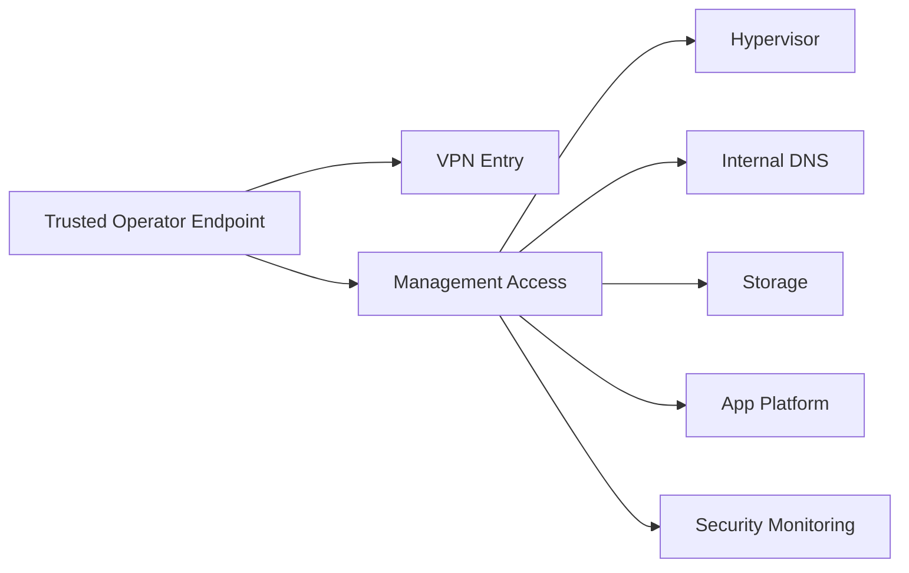

# 03 — Security and Access

## Security objectives

The public security model is intentionally small and explicit:

- isolate by role
- allow only required paths
- keep admin access controlled
- centralize visibility
- avoid leaking sensitive implementation details

---

## Security design principles

| Principle | Meaning in practice |
|---|---|
| Least privilege | no unnecessary host or zone access |
| Segmentation by role | services grouped by function, not convenience |
| Controlled publication | selected services may be proxied; admin surfaces are not public |
| Documentation of exceptions | if a flow is needed, it should be explainable |
| Role-aware hardening | each host type gets controls appropriate to its function |

---

## Public access model

### Intended
- internal services by internal naming
- administration from trusted operator endpoints
- remote administration only through VPN design patterns

### Not intended
- direct public exposure of admin interfaces
- broad lateral communication between internal zones
- one-size-fits-all firewall or hardening templates

---

## Sanitized trust model

---

## Security boundaries

| Component | Security role |
|---|---|
| Hypervisor | segmentation enforcement and critical admin surface |
| Internal DNS | trusted resolver and naming authority for the lab |
| NAS | storage trust boundary and backup concentration point |
| App platform | controlled workload host, not a free-for-all jump box |
| Security monitoring | centralized visibility and event correlation point |
| VPN service | the approved remote-entry pattern |

---

## Hardening philosophy

The lab learned an important lesson:

> hardening should match the host role

That means:

### Good candidates for stricter host firewalling
- internal DNS
- storage/NAS
- SIEM/security hosts
- VPN service

### Hosts requiring special treatment
- container platform hosts
- reverse proxy hosts
- virtualization/control-plane components

Why? Because generic hardening often breaks real service behavior when role-specific networking is ignored.

---

## Public-safe security checklist

This is suitable to publish because it describes **intent**, not secrets.

- [ ] admin interfaces are not exposed directly to the Internet
- [ ] internal DNS is centrally defined
- [ ] segmentation paths are deliberate, not accidental
- [ ] security monitoring exists as a separate concern
- [ ] exceptions are documented
- [ ] backup and recovery logic is treated as part of security
- [ ] public docs remain sanitized

---

## What is intentionally omitted from the public repo

The following should remain private:

- credentials
- API tokens
- webhook endpoints
- key material
- private peer definitions
- actual exposure details
- sensitive logs or screenshots

That omission is not a documentation weakness.  
It is part of the security model.

---

## Risks and open security items

| Item | Status |
|---|---|
| Role-based hardening v2 | planned |
| DNS redundancy | planned |
| Restore proof as a resilience control | still critical |
| Alert routing maturity | in progress |
| More formal threat mapping | optional future improvement |

---

## Summary

The public security story is credible because it avoids two traps:

1. overclaiming
2. oversharing

It shows a real control model without publishing what should stay private.
