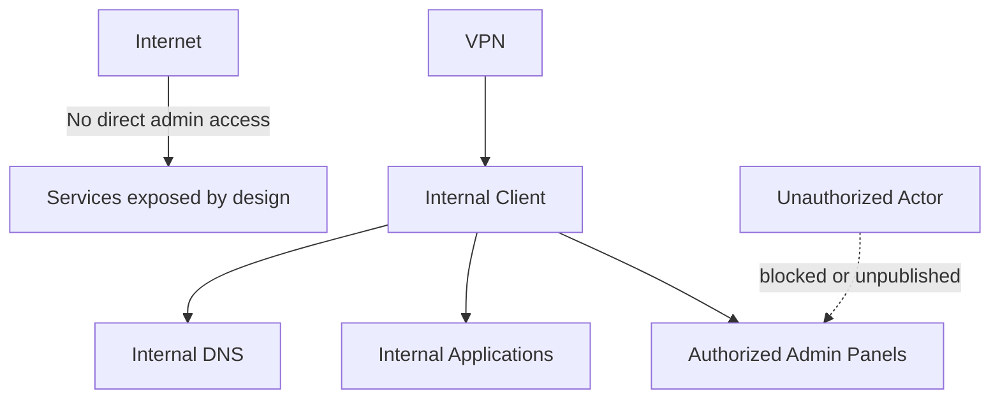

# 03 - Security and Access

## Purpose

Document the homelab security approach without exposing sensitive details.

## Security model

The environment follows a small but explicit model:

- segmentation by role
- least privilege
- reduced lateral movement
- administrative access not publicly exposed
- remote access through a VPN-style pattern
- documented exceptions when cross-zone flows are required
- separation between private and public documentation

## Security design principles

| Principle | Meaning in practice |
|---|---|
| Least privilege | controlled administrative access |
| Segmentation by role | zones separated by purpose |
| Security by design | critical services are not directly exposed |
| Documented exceptions | allowed flows exist only for functional reasons |
| Role-aware hardening | different host roles need different controls |
| Public sanitization | publish intent and reasoning, not sensitive implementation |

## What is not published

- private keys
- secrets
- tokens
- credentials
- real administrative endpoints
- complete VPN configuration
- internal backup or log paths
- complete firewall, SIEM or monitoring configuration
- sensitive offsite backup details

## Access model

### Administrative access

- direct access only from authorized sources
- SSH and internal panels kept under control
- no direct public exposure of administrative interfaces

### Application access

- preference for internal naming
- reverse proxy for selected web services
- direct ports only when operationally justified

### Remote access

- VPN-based model
- external publication only by explicit design
- upstream networking constraints are considered part of the design

## Role-aware hardening

A key lesson from the project is that generic hardening does not fit every host.

| Host type | Recommended approach |
|---|---|
| Internal DNS | allow functional resolver ports and minimal administration |
| NAS / storage | protect shares and panels by source |
| SIEM | expose only required dashboard and agent ports |
| Container host | special handling for bridge networking and proxy behavior |
| Hypervisor | careful control of firewall, forwarding and transit |

## Legitimate cross-zone flows

Some zones need to communicate with others. That does not contradict segmentation; it makes it realistic.

Criteria:

- allow only the required flow
- document why it exists
- validate operational impact
- review it periodically
- do not publish real source/destination rules

## Security as operational evidence

The SIEM is not used only as a dashboard. Its expected role is to retain relevant operational and security events, such as:

- backup failures
- changes to critical components
- disconnected agents
- relevant authentication events
- alerts requiring human action

The public version describes the pattern, not the real rules or raw events.

## Known risks

| Risk | Current mitigation | Pending work |
|---|---|---|
| DNS single point of failure | centralized internal DNS | DNS redundancy |
| Remote access limited by connectivity | local VPN design | relay or upstream improvement |
| Recovery not fully proven | backups and DRP documented | real restore test |
| Noisy alerting | actionable-alert criteria | continuous refinement |
| Growing complexity | runbook and documentation | continuous scope review |

## Threat model lite

## Core idea

Security in this homelab is not based on a single tool. It is based on a combination of:

- segmentation
- controlled publication
- role-aware hardening
- disciplined operations
- security observability
- clear and safe documentation
