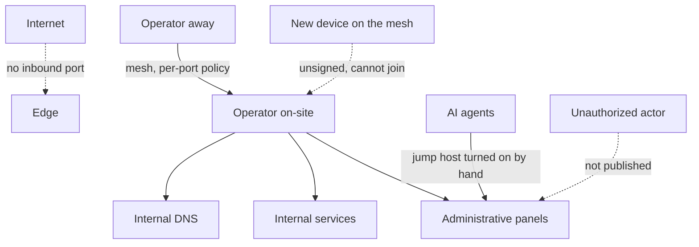

# 03 - Security and Access

> State described: September 2026.

## Purpose

Document the infrastructure security approach without exposing sensitive details.

## Security model

- segmentation by role
- least privilege, sized by measuring real use
- administration not publicly exposed
- **no inbound port at the edge**
- automated access separated from operator access
- documented exceptions when a cross-zone flow is required
- **every control is verified by making it fail**
- separation between private and public documentation

## What is not published

- keys, secrets, tokens and credentials
- real administrative endpoints
- mesh, firewall, SIEM or monitoring configuration
- internal backup or log paths
- destinations and details of the offsite copy

## Access

### Administrative access

- SSH **key-only** on infrastructure hosts; password authentication is disabled
  and verified against the effective configuration
- rescue through the hypervisor console verified, so as not to depend on the
  network
- no administrative interface published to the Internet
- unused accounts retired, in this order: replacement, test, retirement

### Application access

- internal services by name, through a reverse proxy
- in-house applications listen only on their host's local interface and are
  reached by tunnel; they are never published

### Remote access

**The model changed in 2026.**

| Before | Now |
|---|---|
| Point-to-point tunnel with its own concentrator | **Overlay mesh with per-node identity** |
| An inbound port published on the edge router | **No inbound port**: every node dials out to the control plane |
| A dedicated network zone | A layer above the addressing, with no zone of its own |
| Whoever enters the tunnel enters the network | **Policy as code**, default deny, per-port permissions |

**Why it changed:** the previous model required opening the edge, which the rest
of the design avoids. The concentrator was retired and its segment is no longer
advertised.

Decisions in the current model:

- **per-host routes, not the whole subnet.** Advertising the subnet makes the
  environment unreachable from foreign networks that use the same private range,
  which is the most common case;
- the home gateway is not advertised;
- one node acts as internet exit for untrusted networks;
- **the route list is replaced as a whole on every change**, and the internet
  exit lives in that list: re-advertising without it disables it with no error
  and no alert. It happened once and became a written warning;
- **mesh lock with signing nodes**: a new device does not join even with valid
  credentials unless a signing node authorizes it;
- the mesh feature that publishes services to the internet is forbidden;
- node keys expire; expiry is tracked by date so they do not all lapse together;
- a periodic audit of the mesh state emits a metric, and the alert fires if it
  **stops running**.

## Role-based hardening

Generic hardening does not fit every host.

| Host type | Approach |
|---|---|
| Internal DNS | resolution ports and minimal administration |
| NAS / storage | shares and panels by source |
| SIEM | only dashboard and agent ports |
| Container host | special treatment: a generic firewall breaks container networking and the proxy |
| Hypervisor | fine-grained control of firewall, forwarding and transit |
| Mesh gateway | forwards traffic by design; its control is the mesh policy |

**2026 finding:** while surveying filtering to install a new tool, most hosts
**were already filtering** and it was not documented. The plan changed: filtering
is completed where it is missing, with the tool each host already uses.

## Patching

- automatic security patches on Linux hosts, **with no automatic reboot**: if a
  patch needs one, it is flagged for an attended window
- the patch window runs before the backup window, so they do not compete for disk
- container images updated weekly with a health check and **automatic rollback**
  to the previous image
- the most sensitive services are excluded from automatic updates and updated by
  hand after a verified fresh backup
- every task leaves a metric: **automating without observing is not
  automating**. The first survey found automatic patching disabled precisely on
  the security host, with nothing indicating it

## Automation and AI-agent access

Automated accounts, including AI assistants, **do not share the person's access
model**. Turning one off must not turn off the other.

| Property | How it is solved |
|---|---|
| A single path | all automated access goes through a dedicated jump host |
| Manual switch | that host **does not start on its own**: the operator turns it on from the hypervisor |
| Confined credentials | credentials to the rest live only inside the jump host |
| Source restriction | a leaked credential is useless from anywhere else |
| No forwarding | neither port nor agent forwarding |
| Per-account traceability | events go to the SIEM, distinguishing which account did what |
| Read-only code access | the agent reads the code remote with a read-only token that lives on the jump host; writes are tested as rejected |
| No emergency path | explicit decision: if the host is off, ask for it to be turned on |

### Privileged reading without writing

Most useful agent work is **reading**. Authorizing a generic privileged reader is
equivalent to full access, because it can read the password file. This is solved
with an in-house read-only wrapper, with an exclusion list for critical material,
that normalizes paths and inspects content instead of trusting file names.

**No host has a generic privileged permission**, not even the jump host. The
allowed command list came from measuring what was actually invoked. Details in
[Case 05](case-studies/05-ai-agent-access-under-least-privilege.md).

## Control verification

A control that is not tested is a documented assumption. Every security script
checks **what must fail**:

- the read wrapper verifies it denies the password file, a private key and a
  path that tries to evade it;
- privilege reduction verifies that a generic reader and an interpreter are
  denied;
- rotation verifies that the old credential **stops working**;
- SSH hardening queries the effective configuration, not the file.

In a single week, **seven verifications reported a result that did not match
reality**. Details in [Case 06](case-studies/06-when-a-control-does-not-measure-what-it-claims.md).

## Auditing and SIEM

- system auditing active on infrastructure hosts
- SIEM agents on the hosts and on the operator's workstation
- the SIEM records backup failures, disconnected agents and authentication
  events as **evidence**, not as a dashboard

## Known risks

| Risk | Current mitigation | Pending |
|---|---|---|
| DNS with a single resolver | monitored central resolver | a second resolver |
| Incomplete per-host filtering | applied on most hosts | complete the rest |
| In-house apps without built-in authentication | reachable only by tunnel | add authentication |
| Noisy SIEM without system auditing | critical events identified | raise the threshold and ingest auditing |
| Operator devices hardening | per-device keys and mesh lock | complete the hardening |

## Threat model lite

```mermaid
flowchart TD
    A[Internet] -.->|no inbound port| B[Edge]
    C[Operator on-site] --> D[Internal DNS]
    C --> E[Internal services]
    C --> F[Administrative panels]
    M[Operator away] -->|mesh, per-port policy| C
    J[AI agents] -->|jump host turned on by hand| F
    H[Unauthorized actor] -.->|not published| F
    N[New device on the mesh] -.->|unsigned, cannot join| C
```

## Core idea

The security of this infrastructure does not rest on one tool. It rests on:

- no inbound exposure
- segmentation and measured least privilege
- automation separated from the operator
- controls tested by making them fail
- evidence, and honesty about what is still open
