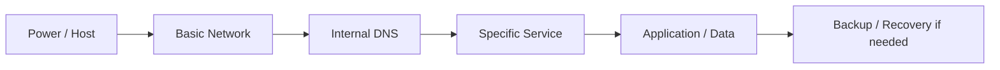

# 04 - Operations Runbook

## Purpose

This public runbook summarizes how the homelab is operated without exposing sensitive details. It does not replace the full private documentation. It is the presentable and defensible version.

## Runbook goals

- review general state
- diagnose incidents without improvising
- validate basic operational capability
- reduce dependence on informal memory
- structure response to failures
- keep real operations separate from the public version

## Diagnostic order

## Daily checklist

| Control | Expected result |
|---|---|
| Hypervisor reachable | operational |
| Internal DNS resolving | correct |
| Application platform up | correct |
| Storage reachable | correct |
| SIEM / monitoring responding | correct |
| Latest backup status | validated in private evidence |
| Offsite copy status | tracked when enabled |
| Critical alerts | reviewed |

## Weekly checklist

| Control | Expected result |
|---|---|
| storage space | sufficient |
| backup growth | under control |
| operational cleanup | executed |
| recent archive | readable |
| general service state | stable |
| critical backlog | reviewed |
| private documentation | evidence updated |
| public documentation | no sensitive data |

## Common operational scenarios

### 1. A web service does not respond

Validate in this order:

1. name resolution
2. network reachability
3. VM or container state
4. proxy or publication path
5. service logs
6. storage or DNS dependency

### 2. Internal DNS failure

Validate:

1. DNS service state
2. listening ports
3. client DNS configuration
4. name resolution from a trusted source
5. impact on dependent services

### 3. Connectivity between zones fails

Validate:

1. zone gateway
2. forwarding
3. NAT
4. allowed cross-zone rules
5. DNS problem versus transit problem

### 4. Storage full or backups failing

Validate:

1. free space
2. growth by backup domain
3. staging or old leftovers
4. retention policy
5. integrity of the last known good backup
6. offsite copy status

### 5. Dashboard or monitoring degraded

Validate:

1. metric source
2. collector/exporter
3. scrape or ingestion
4. dashboard and query
5. whether the data reflects real operations or missing telemetry

## Quick decision matrix

| Symptom | First suspicion |
|---|---|
| network access works, name access fails | DNS |
| several services fail together | hypervisor or network |
| backup runs but content is inconsistent | pipeline, staging or validation |
| remote access is partial | VPN, routes or NAT |
| web service fails but VM responds | proxy or application |
| dashboard is red while service is healthy | metric, exporter or query |

## Minimum controls by component

| Component | What to validate |
|---|---|
| Hypervisor | VMs, network, storage, transit |
| Internal DNS | service, resolution, ports |
| Application platform | containers, proxy, resources |
| Storage | space, shares, backup directories |
| SIEM | main services, agents and ingestion |
| VPN | interface, handshake, expected reachability |
| Dashboards | real data, freshness and usefulness |

## Rollback and recovery

When to consider rollback:

- the recent change is clearly the source of the issue
- hot-fixing increases risk
- a trustworthy snapshot or backup exists
- reverting is safer than continuing to change things

## Operational lessons incorporated

- snapshot is not backup
- generated backup is not trustworthy backup
- executed schedule is not validation
- green dashboard is not recoverability
- if it is not validated, it does not exist
- diagnostic order matters

## What this runbook demonstrates

The environment was not just installed. It was designed to be operated, observed and recovered with judgment.
