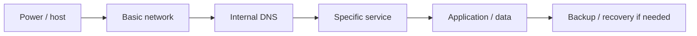

# 04 - Operations Runbook

> State described: September 2026.

## Purpose

Summarize how the homelab is operated without exposing sensitive details. It does
not replace the internal documentation; it is its presentable version.

## How it is operated in practice

The environment is run by one person, so a manual daily review does not scale.
The model is:

- **alerts fire only when something failed, was not done or stopped
  happening.** No confirmations that everything is fine: they teach you to ignore
  the channel;
- dashboards are for looking when you want to look, not for finding out about
  failures;
- a weekly review covers what no alert measures;
- every work session starts by reading how the previous one closed and **measures
  again** what it is about to state: a status written yesterday may already be
  stale.

## Diagnosis order

```mermaid
flowchart LR
    A[Power / host] --> B[Basic network]
    B --> C[Internal DNS]
    C --> D[Specific service]
    D --> E[Application / data]
    E --> F[Backup / recovery if needed]
```

## Weekly review

| Check | Expected result |
|---|---|
| storage space | above the threshold that decides whether backup runs |
| backups and offsite copy | recent content, not just a recent archive |
| restore tests | recent, successful last run |
| patches | no accumulated pending reboots |
| hypervisor machines | all in the expected state after the last reboot |
| critical pending items | reviewed against the real environment |
| public documentation | no sensitive data |

## Typical operational scenarios

### 1. A web service does not respond

1. name resolution
2. network reachability
3. VM or container state
4. proxy or publication
5. service logs, **scoped to the last start**
6. storage or DNS dependency

### 2. Internal DNS fails

1. service state
2. listening ports
3. client pointing to the right resolver
4. resolution from a trusted source
5. impact on dependent services

### 3. Cross-zone connectivity problem

1. zone gateway
2. forwarding
3. NAT
4. allowed cross-zone rules
5. DNS problem vs. transit problem

### 4. Storage full or backups failing

1. free space, **on the host and not only inside the VM**
2. snapshots retaining old blocks
3. growth by domain and leftovers
4. retention policy
5. integrity of the last good backup
6. offsite copy state

### 5. Partial remote access

1. node state on the mesh
2. advertised **and approved** routes
3. mesh policy for that source and port
4. internet exit included in the route list
5. the local network is not capturing the route by specificity

### 6. Inconsistent dashboard or alert

1. metric source and exporter
2. scrape or ingestion
3. dashboard and query
4. **whether the metric measures the outcome or only that a step ran**

## Quick decision matrix

| Symptom | First suspect |
|---|---|
| works by address, not by name | DNS |
| several services down at once | hypervisor or network |
| "recent" backup with old content | an earlier link of the chain |
| deleting does not free space | a snapshot |
| partial remote access | advertised routes, mesh policy or local route |
| an alert that never arrives | the notification path, not the detection |
| green dashboard, broken service | the metric measures something else |

## Changes and deletions

- every change comes from a commit and a verifiable block; production is not
  edited by hand
- every destructive step requires a copy **verified by opening it**
- **nothing is deleted directly**: it goes to a thirty-day quarantine with a
  manifest
- repositories are deleted only if their content is fully contained in another,
  verified commit by commit; otherwise they are archived
- roll back when the recent change is clearly the cause and going back costs less
  than continuing to touch things

## Rebuilding the workstation

The operator's workstation has its own procedure, tested on a clean machine with
the same two accounts as the real one:

1. before: encrypted backup, configuration capture and a check that every
   repository has an up-to-date remote;
2. after: installation as administrator, restore as an unprivileged user, and
   task registration as administrator again;
3. the procedure is written to be followed **without assistance**, including
   known failures and how to get out of each one.

Details in [Case 07](case-studies/07-workstation-migration-and-backups-that-lied.md).

## Operational lessons built in

- a snapshot does not replace a backup, and it also retains space
- a generated backup is not a backup with new data
- a task that ran is not a validated task
- a configuration read is not an observed behavior
- an SSH drop does not prove a reboot: confirm it with the boot time
- if it is not validated, it does not exist
