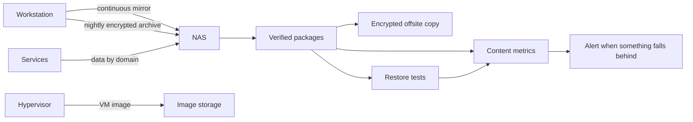

# 05 - Backup and Recovery

> State described: September 2026.

## Purpose

Describe the homelab backup and recovery strategy.

## Principles

- recovering is worth more than having a copy
- **a backup is measured by the age of its content, not of its archive**
- a snapshot and a backup are not the same thing
- an offsite copy without a tested restore is not enough
- a backup failure has to raise an alert on its own
- the material needed to decrypt or restore is also critical, and does not live
  only inside the system it recovers

## Model layers

| Layer | What it covers |
|---|---|
| VM image | rollback of whole machines |
| Data by domain | service configuration and data, packaged and hash-verified |
| Workstation mirror | continuous sync of the data disk to the NAS |
| Workstation configuration backup | nightly encrypted archive of the work profile |
| Code remote | full repository history, at home |
| Offsite copy | encrypted copy of the critical domains |
| Restore tests | evidence that recovery is real |
| Evidence | metrics, events and alerts |

## Logical flow

## The chain that broke silently

In 2026 it turned out that the workstation backup had been frozen for almost four
months. The chain had five links; it broke at the first one and the other four
kept running. **The metric measured the age of the compressed archive, not of its
content**, so it reported a backup a few hours old.

It was replaced with a simpler scheme, and the principle was written down: the
metric must measure **what the backup contains**. Details in
[Case 07](case-studies/07-workstation-migration-and-backups-that-lied.md).

## Window and thresholds

- backups run in a low-activity window, after patching
- **if storage lacks the minimum free space, the backup does not run** and the
  failure is visible; that beats filling the disk in the middle of the night
- metrics refresh after the window should have finished
- the question they answer: *can I operate today with confidence?*

## Backing up open files

Part of what is backed up belongs to tools that never close. The criterion, set by
the machine's owner: **losing a few hours is acceptable; restoring something
months old while believing it is from yesterday is not.**

- open files are read in shared mode;
- included databases are checked by extracting them from the backup;
- an incomplete backup is marked as such and **does not renew the success
  metric**.

## Offsite copy

- content is encrypted
- recovery keys live outside the system being recovered
- destinations, paths and configurations are not published
- its freshness has its own metric and alert

**2026 lesson:** the offsite copy failed several days in a row without an alert.
The script ended with an explicit exit code, and the error trap meant to notify
does not fire in that case. Notification now hooks into process exit, which
always happens.

## Restore tests

They run on a dedicated machine, separated from production. **Validation stores
no credentials**: instead of a real login, it validates:

- package integrity (hash), database integrity and expected counts
- real startup of the service from the backup, in an instance that listens only
  on the local interface and is never published
- valid structure of the documentation vault, without opening its content live

Properties:

- restored data is ephemeral, deleted at the end of every run
- backup access through a restricted channel that only hands out the latest
  package
- evidence keeps counts and metadata, never content
- every run publishes **RTO and RPO** as metrics

Measured results: the small service recovers in **seconds** and the
documentation domain in **under two minutes**, dominated by package size.

**Honest status:** the tests worked and keep succeeding, but **their periodic run
was interrupted during the September migration**, and nothing flagged it: no
alert was watching whether the test stopped running. The cause is still to be
confirmed, and the missing rule is an alert for a *late restore test*. It was
found while updating this documentation.

## Key distinction

| Concept | Correct use |
|---|---|
| Snapshot | fast rollback before a change; created with a retirement date |
| Backup | portable recovery |
| Offsite copy | resilience against local loss |
| Code remote at home | history and collaboration; **not** an offsite copy |
| Restore test | evidence that recovery is real |
| Alert | actionable signal, not a replacement for validation |

## Recovery scenarios

| Scenario | Path |
|---|---|
| Service failure | check DNS, network and storage; restore the domain; confirm health |
| VM failure | rollback by snapshot or image; validate startup and reachability |
| Partial storage loss | isolate; recover from local package or external copy |
| Workstation loss | rebuild procedure tested on a clean machine |
| Broad loss | base platform, DNS, storage, services by priority |

## Recovery priority

| Priority | Component |
|---|---|
| High | hypervisor, internal DNS, storage, mesh gateway, app platform |
| High | critical service data and configuration, code remote |
| Medium | observability and dashboards |
| Variable | auxiliary or lab services |

## Open risks

| Risk | State |
|---|---|
| periodic restore test run | interrupted; resume and alert on lateness |
| image backup of every VM | partial: some machines only back up data |
| offsite copy of the code remote | pending, to external media |
| physical storage redundancy | a support disk failed; replacement postponed |

## Core idea

> recovery awareness, measured by content and proven by restoring.
