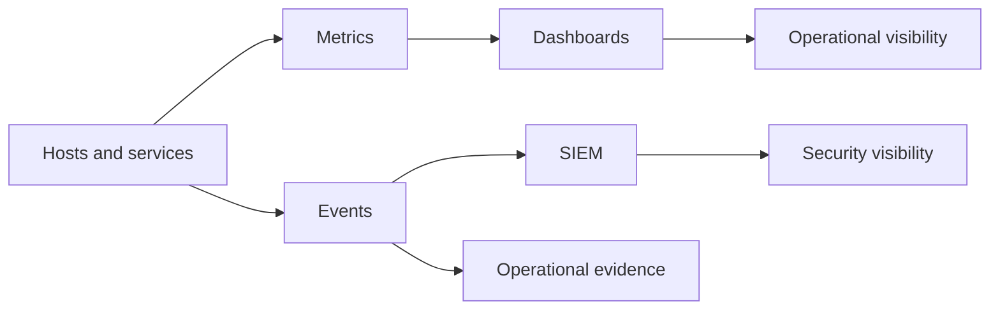
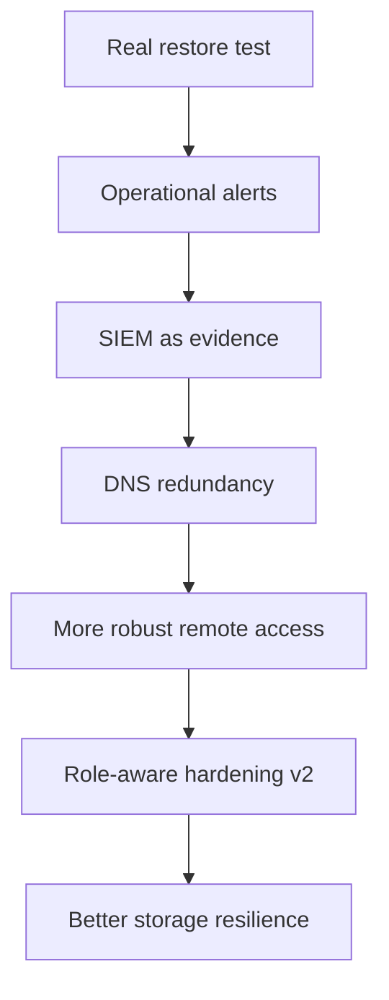

# 06 - Observability and Roadmap

## Purpose

Explain how the environment is observed and where it is evolving.

## Conceptual separation

This homelab separates three layers that are often mixed together:

| Layer | Purpose |
|---|---|
| Infrastructure observability | health, resources, availability, performance |
| Security visibility | events, agents, telemetry, investigation |
| Operational evidence | proof that backups, alerts and controls worked |

## Logical stack

## What observability should answer

- what is down
- what is degraded
- what changed
- which service is consuming more resources
- which critical dependency stopped responding
- which incident requires immediate attention
- which backup or offsite copy failed or missed its window

## Real value

Observability is not here to decorate dashboards. It is here to improve operations and speed up diagnosis.

## Operational dashboards

Dashboards are designed to answer concrete questions:

- general environment health
- availability of core services
- backup and offsite state
- storage pressure
- signals relevant for a NOC-style or operations view

Public rule:

- do not publish real dashboard JSON when it contains paths, hosts or sensitive queries
- document purpose and design criteria
- keep private before/after JSON backups for real dashboard changes

## SIEM as evidence

The SIEM is used as a security and operational evidence layer. Public use examples:

- raise backup failures as high-severity alerts
- detect disconnected agents
- retain relevant events for technical audit
- separate tactical alerting from historical evidence

The public version does not include real rules, IDs, paths, JSON events or agent names.

## Current state

### Solved

- baseline metrics
- infrastructure dashboards
- initial security visibility
- distinction between monitoring and security
- backup window validated with automated evidence (consecutive cycles confirmed, event and checksum emitted per run)
- SIEM active agent inventory completed; agents for decommissioned hosts removed from the manager
- NOC display node operational: internal DNS resolving, kiosk towards operational dashboard validated
- public documentation of the approach
- separation between private and public documentation

### Maturing

- actionable alerts by channel (critical notifications; integration pending)
- more executive dashboards
- finer storage and network monitoring
- better integration of critical events
- restore tests as recovery evidence (active critical path)

## Prioritized roadmap

## Ordered backlog

| Priority | Item | Why it matters |
|---|---|---|
| Critical | restore test | closes the gap between backup and recovery |
| High | operational alerts | reduces time to react |
| High | SIEM evidence for backups | proves failures and status with traceability |
| High | DNS redundancy | reduces a central dependency risk |
| High | remote access refinement | addresses connectivity limitations |
| Medium | role-aware hardening v2 | matures controls without breaking operations |
| Medium | storage improvements | resilience and capacity |
| Medium | more executive dashboards | faster operational reading |

## Correct roadmap reading

The next step is not adding more things. It is closing what already matters:

- recover
- alert
- evidence
- tolerate failures better
- operate with more confidence

## Conclusion

Observability and roadmap maturity are shown by making clear:

- what already works
- what is still fragile
- what is prioritized
- why
