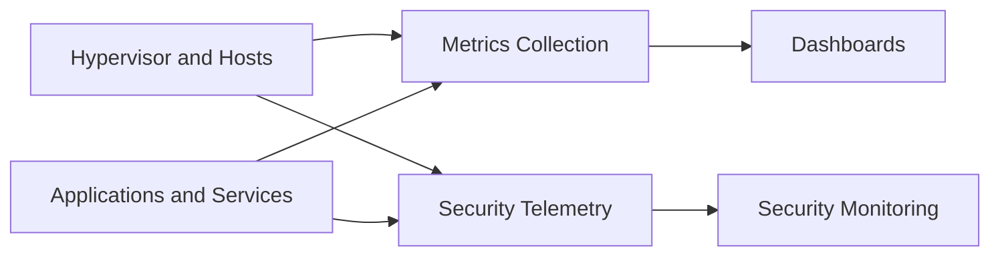

# 06 — Observability and Roadmap

## Observability goal

Monitoring exists to answer three practical questions:

1. is the platform healthy?
2. is the service path healthy?
3. is the security posture observable?

If it cannot answer those, it is decoration.

---

## Observability model

The lab deliberately separates:

- **infrastructure observability**
- **security visibility**

That distinction matters.

| Discipline | Purpose |
|---|---|
| Infrastructure observability | resource usage, service health, reachability, trend visibility |
| Security visibility | telemetry, events, suspicious behavior, host-level signal collection |

---

## Public-safe monitoring stack view

---

## What should be visible

### Platform health
- host availability
- VM availability
- CPU and memory trends
- storage pressure
- backup destination pressure

### Service health
- internal service reachability
- reverse proxy health
- dashboard/service responsiveness
- backup workflow recency

### Security health
- host telemetry ingestion
- security monitoring availability
- enrollment/agent stability
- major control-plane anomalies

---

## Current maturity

| Area | Status |
|---|---|
| basic metrics | operational |
| dashboards | operational |
| security monitoring base | operational |
| useful alerting | still being refined |
| recovery observability | still incomplete until restore tests are documented |

---

## Why alerting is not “done” yet

Good alerting is selective.

Bad alerting creates:

- noise
- desensitization
- fake confidence
- blind spots hidden in spam

A mature alerting model should focus on:

- real failures
- degraded states
- missed backup windows
- storage pressure
- control-plane issues

---

## Public roadmap

### Near-term
- formalize a cleaner public repository structure
- improve documentation consistency
- keep the public version easy to explain

### Short-term technical priorities
- restore testing and documentation
- alerting refinement
- DNS redundancy
- clearer remote access architecture

### Medium-term priorities
- role-aware hardening v2
- improved storage resilience
- stronger visibility for networking and backup confidence
- more explicit dependency documentation

---

## Roadmap board

| Priority | Item | Why it matters |
|---|---|---|
| Critical | restore test | proves recovery |
| Critical | alert routing maturity | improves real operations |
| High | DNS redundancy | reduces a central dependency risk |
| High | remote access architecture refinement | improves resilience and explainability |
| High | role-based hardening v2 | aligns controls to service function |
| Medium | storage resilience improvements | supports backup durability |
| Medium | richer backup validation reporting | improves confidence |
| Medium | more formal interview-friendly diagrams | improves presentation quality |

---

## How to present this in an interview

Use this sequence:

1. “Here is the architecture.”
2. “Here is how it is secured.”
3. “Here is how I operate it.”
4. “Here is how I think about backup and restore.”
5. “Here is what is still open and why.”

That last step matters.  
A professional project does not pretend to be finished.  
It shows **judgment about what still matters**.

---

## Final takeaway

This homelab is strongest when presented as:

- deliberate
- segmented
- monitored
- recoverable in design
- honest about remaining gaps

That is more credible than a louder repo with less control.
