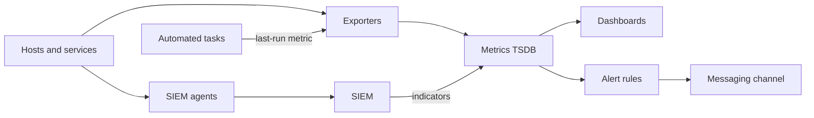
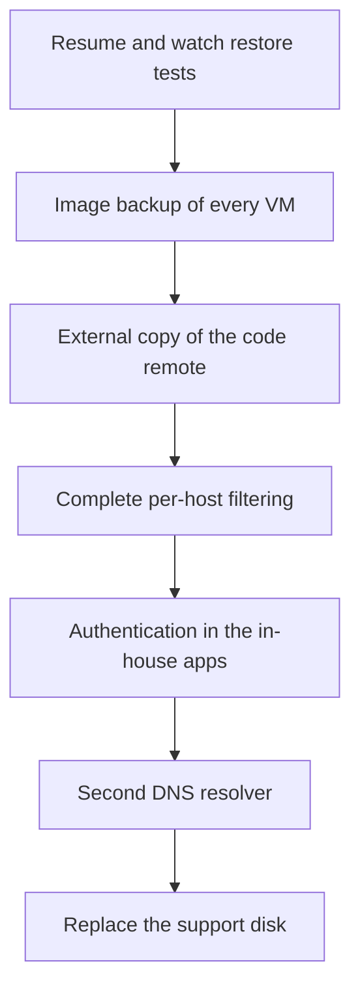

# 06 - Observability and Roadmap

> State described: September 2026.

## Purpose

Explain how the environment is observed, how it alerts and where it is heading.

## Conceptual separation

| Layer | Purpose |
|---|---|
| Infrastructure observability | health, resources, availability |
| Security visibility | events, agents, telemetry |
| Operational evidence | proof that backups, patches and controls worked |
| Alerts | notice of what failed, was not done or stopped happening |

## Logical stack

```mermaid
flowchart LR
    A[Hosts and services] --> B[Exporters]
    T[Automated tasks] -->|last-run metric| B
    B --> C[Metrics TSDB]
    C --> D[Dashboards]
    C --> R[Alert rules]
    R --> M[Messaging channel]
    A --> E[SIEM agents]
    E --> S[SIEM]
    S -->|indicators| C
```

## What is measured

- host and service availability, through network, HTTP and DNS probes
- hypervisor and container resources
- freshness and result of every backup domain and of the offsite copy
- age of the workstation nightly backup
- restore tests: result, RTO and RPO
- pending patches, pending reboots and last patching run
- container updates, failed and rolled back
- remote access mesh state and its audit
- SIEM indicators: active agents and high-severity alerts
- whether the agents' jump host is on

**Rule:** every automated task leaves a metric with the time of its last
successful run. Without that metric, a task that stops running is invisible.

## Alerts

Alerts go from the dashboard layer to a messaging channel. There are only three
valid forms:

| Form | Example |
|---|---|
| Something failed | an exporter down, a probe that does not answer |
| Something was not done | late backup, unapplied patches, pending reboot |
| Something stopped happening | the mesh audit went silent, an indicator not updated |

**Forbidden in the channel:** confirmations, daily summaries, "backup completed".
They teach you to ignore the phone. *Resolved* notices are kept because they close
a notice that was already sent.

Rules have no conditional routing: no alert is lost for not matching a filter.

**History:** the first alert channel was a chat that never delivered anything;
for months **no alert reached anywhere**, while the rules kept evaluating. It was
replaced with a messaging channel with native integration. The lesson: an alert
without a verified destination is not an alert.

## Dashboards

They are designed to answer concrete questions: overall health, backup and
offsite state, storage pressure, patches and remote access.

- the real dashboard JSON is not published
- each dashboard's goal is documented
- changes are backed up before and after

The console dedicated to showing dashboards on a screen was retired: messaging
alerts made it unnecessary.

## SIEM as evidence

- backup failures are raised to high-severity events
- disconnected agents are detected
- tactical alerting is separated from historical evidence

The public version includes no rules, identifiers or events.

## Current state

### Working

- metrics from every infrastructure host and availability probes
- failure alerts to the messaging channel
- content metrics for backups and the offsite copy
- patching and container update metrics
- mesh audit with a silence alert
- SIEM indicators integrated into monitoring

### Maturing

- alert for a **late** restore test, not only a failed one
- SIEM noise: the vast majority of its alerts are low severity
- ingestion of system auditing into the SIEM
- more readable dashboards for a quick review

## Prioritized roadmap

```mermaid
flowchart TD
    A[Resume and watch restore tests] --> B[Image backup of every VM]
    B --> C[External copy of the code remote]
    C --> D[Complete per-host filtering]
    D --> E[Authentication in the in-house apps]
    E --> F[Second DNS resolver]
    F --> G[Replace the support disk]
```

## Ordered backlog

| Priority | Item | Reason |
|---|---|---|
| High | Restore tests with a lateness alert | today they can stop running silently |
| High | Reliable startup of every VM | a real reboot left two machines off |
| High | Image backup for every VM | some only back up data |
| High | External copy of the code remote | a remote at home is not an offsite copy |
| Medium | Complete per-host filtering | close the measured gap |
| Medium | Authentication in the in-house apps | do not rely only on the tunnel |
| Medium | Second DNS resolver | single point of failure |
| Medium | Reduce SIEM noise | useful signal over volume |
| Low | Replace the support disk | postponed for budget |

## Reading the roadmap

The next step is not adding tools. It is closing what matters better: recover,
alert, evidence and withstand failures.

## Conclusion

Observability shows maturity when it makes clear:

- what already works
- what is still fragile
- what is prioritized and why
- and that everything that stops running **says so on its own**
