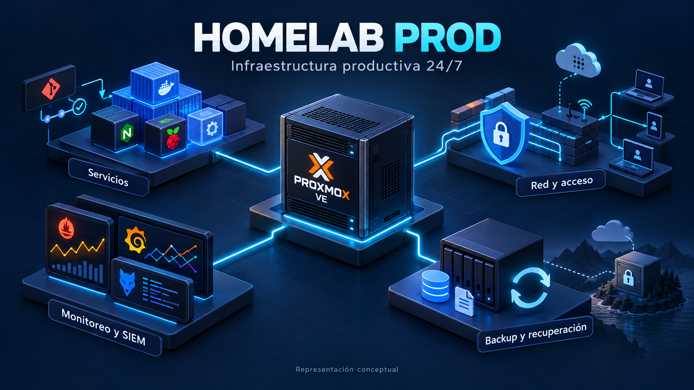
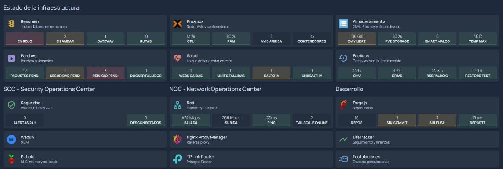
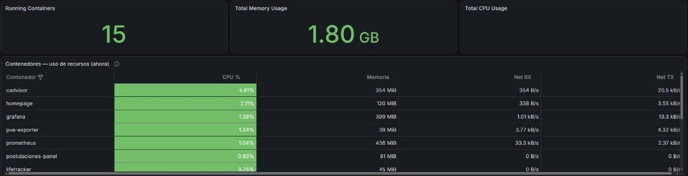
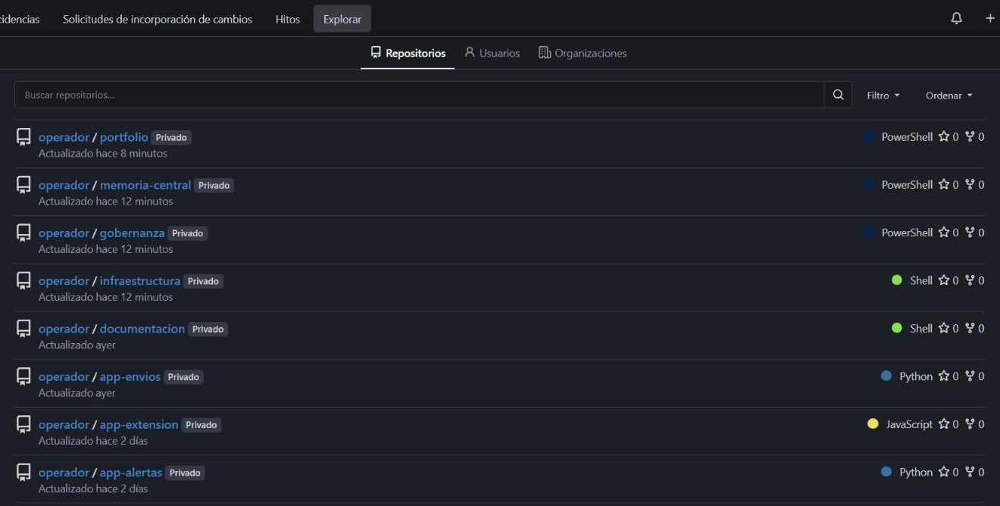
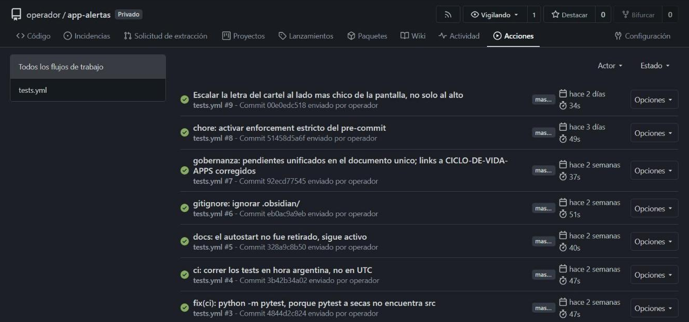
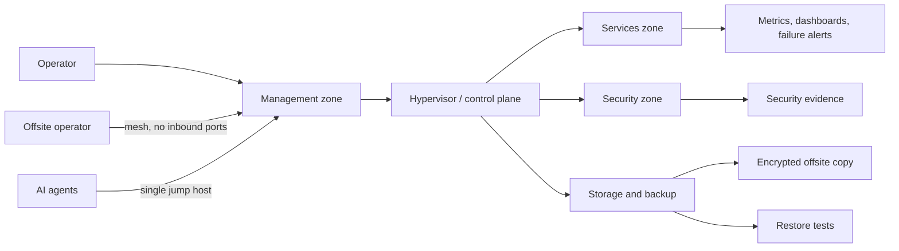

# Homelab Prod

**Language / Idioma:** English | [Espanol - vista completa](../../README.md)

A conceptual representation of the platform's components; not a screenshot or an exact map of the environment.

> One-person production infrastructure: small in scale, complete in components, running 24/7.

**Not a test lab: production infrastructure.** It does not have the scale of a
company, but it has all the pieces: virtualization, a segmented network, DNS,
storage, backups with an offsite copy, monitoring, SIEM, remote access,
applications in real use and a private code remote. It runs 24/7 on a type-1
hypervisor on a dedicated server. When something fails, the impact is real.

This repository is **the complete view**. Each area also has its own repository,
with details, figures and cases (see [The series](#the-series)).

## In 30 seconds

| Indicator | Result |
|---|---|
| Open inbound ports at the edge | **0** |
| Unauthorized attempts blocked by the access policy in one incident | **13,017** in 34 hours |
| Automated checks reporting false results, detected and corrected | **7** in one week |
| Frozen backup incorrectly reported as healthy, detected and corrected | **almost 4 months** |
| Recovery measured in restore tests | **seconds** to **under 2 minutes** |
| Documented real-world cases, including what went wrong | **8** |

## Small scale, production standards

| Component | Tools and approach | Impact of failure |
|---|---|---|
| Virtualization | Proxmox VE, type-1 hypervisor; one machine per function | everything else goes down |
| Internal DNS | Pi-hole, resolution for all devices and services | everything looks down even when healthy |
| Network and remote access | functional zones; Tailscale without open ports, per-port policy | isolation or remote access is lost |
| Storage and backups | OpenMediaVault, nightly backups, encrypted offsite copy, restore tests | recovery capability is lost |
| Monitoring and security | Prometheus, Grafana, Wazuh and phone alerts | incidents go unnoticed |
| Own applications | Docker behind Nginx Proxy Manager; one sends real email | real work stops |
| Code | Private Forgejo with continuous integration | nowhere to version code or deploy from |

The same discipline as a company, at small scale: planned changes and rollback,
evidence, automatic alerts and controls tested by making them fail.

## Live views

_Real screenshots of the environment, with names, addresses, users and versions replaced by their function. Figures shown below describe the captured snapshots, not a live status feed._

Custom operations dashboard: status, patches, health, backups, security, network and development in one screen.

Proxmox VE: nine machines, one per function, with 12 days of uptime in the snapshot.

Grafana: 13 exporters and 25 availability probes, with no outages in the displayed snapshot.

15 production containers and their resource consumption.

Forgejo: all code lives in a private, self-hosted remote.

Continuous integration: every commit runs the tests.

## Architecture

## Problem, decision, outcome

| Problem | Why it mattered | Action | Outcome |
|---|---|---|---|
| Remote access required opening an edge port | the rest of the design avoids exposing the edge | a mesh with node identity and per-port policy | 0 inbound ports; 13,017 unauthorized attempts blocked |
| An AI agent using keys on the operator's workstation was effectively the operator | its access could not be cut or audited separately | one jump host with a manual kill switch | the agent **cannot**, rather than **must not** |
| A backup had been frozen for almost 4 months while its metric reported "hours" | stale data could have been restored under the assumption it was from yesterday | measure content age, not file age | old data can no longer be reported as successful fresh backups |
| Seven checks reported false results | a lying control creates confidence without protection | verify the effect and what must fail | a practice applied to every security script |
| Configuration said everything would start automatically after a reboot | a real reboot disproved that for 2 machines | a real reboot test, confirmed by kernel and boot time | the risk is documented, not hidden |

## The series

| Repository | Focus | Key point |
|---|---|---|
| [Zero Trust Remote Access](https://github.com/Nicolasperaltait/zero-trust-remote-access) | remote access without open ports and least-privilege AI agents | 0 inbound ports |
| [Network Segmentation Playbook](https://github.com/Nicolasperaltait/network-segmentation-playbook) | functional segmentation, internal DNS, what passed, what did not and what was prevented | 13,017 attempts blocked |
| [Alerts That Matter](https://github.com/Nicolasperaltait/alerts-that-matter) | alerts, SIEM and controls verified by their effect | 7 misleading controls |
| [Backups That Don't Lie](https://github.com/Nicolasperaltait/backups-that-dont-lie) | backups measured by their content and tested restores | RTO measured in seconds |
| [Hypervisor as Control Plane](https://github.com/Nicolasperaltait/hypervisor-as-control-plane) | operating the hypervisor as a production platform | verified reboot, not assumed |
| [SecOps Governance Blueprint](https://github.com/Nicolasperaltait/secops-governance-blueprint) | SOC, SIEM, measured hardening and decisions not to implement something | complete SOC |

## Other projects

Own applications and automation, with their public repositories:

| Repository | Focus |
|---|---|
| [Debian Scripts](https://github.com/Nicolasperaltait/debian-scripts) | modular Linux system automation with Bash |
| [Faraday ParanoIA](https://github.com/Nicolasperaltait/faraday-paranoIA) | local AI and document search with sources |
| [WA Audio Local Transcriber](https://github.com/Nicolasperaltait/wa-audio-local-transcriber) | local transcription of WhatsApp audio messages |

All repositories: [Nicolas's GitHub portfolio](https://github.com/Nicolasperaltait).

## Case studies

| Case | What it demonstrates |
|---|---|
| [01 - Storage pressure and backup recovery posture](case-studies/01-storage-pressure-and-backup-recovery-posture.md) | recovery matters more than having copies |
| [02 - Monitoring blocked by segmentation](case-studies/02-monitoring-path-blocked-by-segmentation.md) | minimal, documented exceptions |
| [03 - Backup events as SIEM evidence](case-studies/03-backup-events-as-siem-evidence.md) | security connected to operational risk |
| [04 - Storage migration and controlled reboot](case-studies/04-storage-migration-observability-and-controlled-reboot.md) | sensitive changes with rollback and evidence |
| [05 - AI agent access under least privilege](case-studies/05-ai-agent-access-under-least-privilege.md) | infrastructure controls, not behavioral instructions |
| [06 - When a control does not measure what it claims](case-studies/06-when-a-control-does-not-measure-what-it-claims.md) | verify the effect, not the action |
| [07 - Workstation migration and backups that lied](case-studies/07-workstation-migration-and-backups-that-lied.md) | an untested plan is a hypothesis |
| [08 - Tidying up a NAS nobody used](case-studies/08-tidying-up-a-nas-nobody-used.md) | test from the user's perspective |

## Documentation

| Topic | English | Espanol |
|---|---|---|
| Executive architecture | [00](00-executive-architecture.md) | [00](../es/00-arquitectura-ejecutiva.md) |
| Executive summary | [01](01-executive-summary.md) | [01](../es/01-resumen-ejecutivo.md) |
| Architecture and network | [02](02-architecture-and-network.md) | [02](../es/02-arquitectura-y-red.md) |
| Security and access | [03](03-security-and-access.md) | [03](../es/03-seguridad-y-accesos.md) |
| Operations runbook | [04](04-operations-runbook.md) | [04](../es/04-runbook-operativo.md) |
| Backup and recovery | [05](05-backup-and-recovery.md) | [05](../es/05-backup-y-recuperacion.md) |
| Observability and roadmap | [06](06-observability-and-roadmap.md) | [06](../es/06-observabilidad-y-roadmap.md) |
| Architecture decisions | [07](07-architecture-decisions.md) | [07](../es/07-decisiones-arquitectonicas.md) |
| Case studies | [index](case-studies/README.md) | [indice](../es/casos-de-estudio/README.md) |

## What is not published, and why

IP addresses, hostnames, domains, users, exact versions, credentials, full
configurations, raw logs and rollback paths. **Omission is part of the security
model**, not missing documentation. The complete operational documentation is
private.

## License

See [LICENSE.md](../../LICENSE.md).
