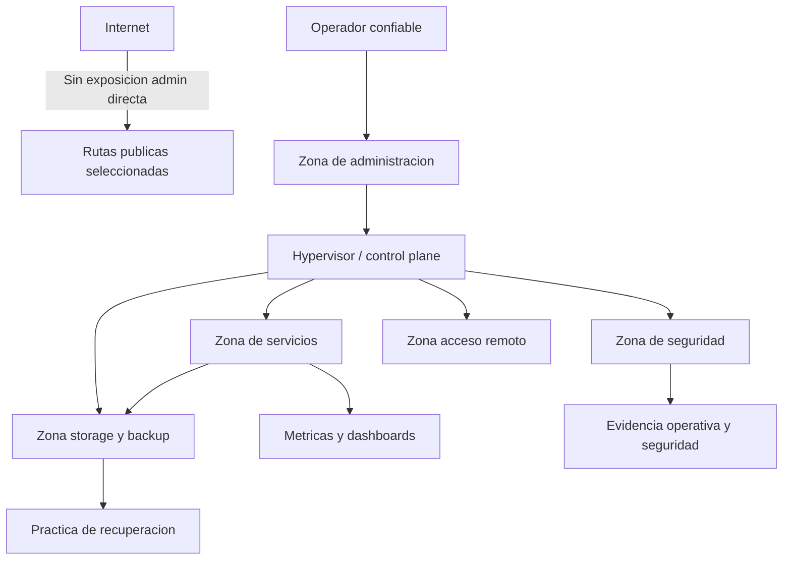

# 00 - Arquitectura Ejecutiva

## Problema

Un homelab puede convertirse facilmente en una coleccion de herramientas sin modelo operativo. Este proyecto trata el entorno como una plataforma pequena de infraestructura, con limites de seguridad, evidencia operativa y expectativas de recuperacion.

El problema de diseno es:

> como operar una plataforma interna realista sin convertirla en un entorno desordenado, sobreexpuesto o imposible de explicar.

## Arquitectura objetivo

El entorno se organiza alrededor de zonas funcionales:

- administracion y control plane
- servicios internos
- monitoreo de seguridad
- storage y backup
- acceso remoto
- observabilidad

## Decisiones clave

| Decision | Por que importa |
|---|---|
| Tratar el hypervisor como control plane | no es solo computo; ancla segmentacion, transito y recuperacion |
| Mantener privadas las superficies administrativas | reduce exposicion y vuelve entendibles los limites de confianza |
| Centralizar DNS interno | hace consistente el acceso y convierte DNS en dependencia gestionada |
| Separar monitoreo de visibilidad de seguridad | metricas y evidencia de seguridad responden preguntas distintas |
| Orientar backups a recuperacion | tener archivos no alcanza sin confianza de restore |
| Publicar solo documentacion sanitizada | claridad tecnica sin filtrar implementacion sensible |

## Tradeoffs

| Tradeoff | Posicion |
|---|---|
| Simplicidad vs. cantidad de servicios | preferir menos componentes con roles claros |
| Segmentacion vs. comodidad operativa | permitir flujos entre zonas solo si estan justificados |
| Detalle publico vs. seguridad | publicar razonamiento, no implementacion exacta |
| Dashboard vistoso vs. senal accionable | priorizar estado util sobre ruido visual |
| Automatizacion de backup vs. prueba de recuperacion | automatizar ayuda, pero restore define confianza |

## Controles

- segmentacion por funcion
- acceso administrativo controlado
- disciplina de nombres internos y DNS
- estrategia offsite documentada como control de recuperacion
- runbook operativo y orden de diagnostico
- evidencia de eventos criticos via SIEM
- separacion entre evidencia privada y documentacion publica

## Riesgos residuales

| Riesgo | Por que sigue importando |
|---|---|
| Confianza de restore | un sistema no madura hasta probar y documentar recuperacion |
| Dependencia DNS | DNS centralizado simplifica, pero queda como dependencia clave |
| Restricciones de acceso remoto | la conectividad upstream condiciona el diseno final |
| Ruido de alertas | alertar demasiado destruye utilidad |
| Resiliencia de storage | backup depende de salud de storage y caminos de recuperacion |

## Roadmap

1. Restore tests formales.
2. Ruteo y escalamiento de alertas mas claro.
3. Evidencia operativa respaldada por SIEM.
4. Redundancia DNS.
5. Hardening v2 por rol.
6. Mas diagramas ejecutivos y case studies.

## Lectura de arquitectura

Este proyecto debe leerse como registro de arquitectura y operacion:

- limites y dependencias explicitos
- tradeoffs y riesgos residuales documentados
- backup tratado como recuperacion, no como generacion de archivos
- documentacion publica separada de evidencia operativa privada
- cada componente tiene una razon documentada para existir
