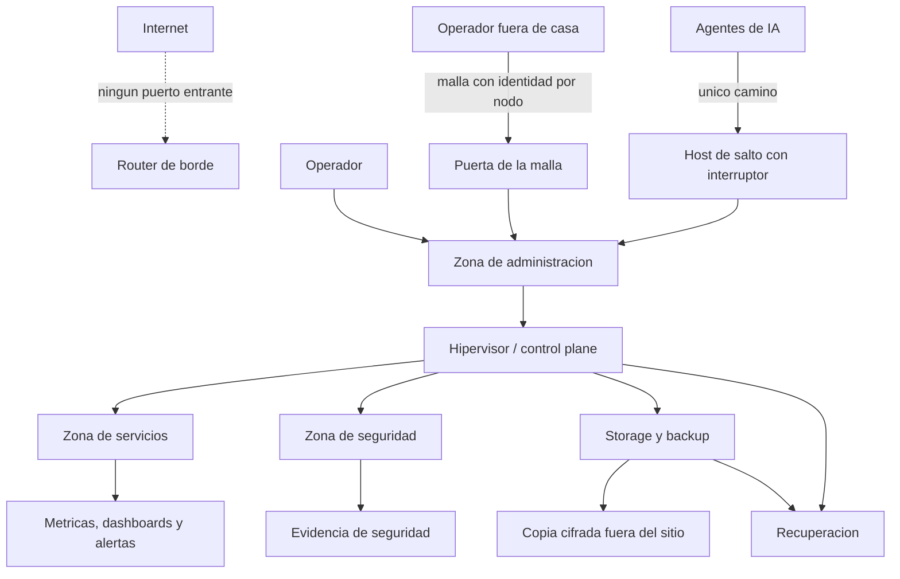

# 00 - Arquitectura Ejecutiva

> Estado descrito: septiembre de 2026.

## Problema

Un homelab puede convertirse facilmente en una coleccion de herramientas sin
modelo operativo. Este proyecto trata el entorno como una plataforma pequena de
infraestructura, con limites de seguridad, evidencia operativa y expectativas de
recuperacion, operada por una sola persona.

El problema de diseno es:

> como operar una plataforma interna realista sin convertirla en un entorno
> desordenado, sobreexpuesto o imposible de explicar.

## Arquitectura vigente

El entorno se organiza en zonas funcionales, todas ancladas en un unico
hipervisor:

- administracion y control plane
- servicios internos y aplicaciones propias
- monitoreo de seguridad
- storage, backup y recuperacion
- acceso remoto por malla superpuesta, **sin puertos entrantes**
- acceso automatizado y de agentes de IA, por un unico host de salto
- observabilidad y alertas

```mermaid
flowchart TB
    Internet[Internet] -.->|ningun puerto entrante| Borde[Router de borde]
    Operador[Operador] --> Mgmt[Zona de administracion]
    Remoto[Operador fuera de casa] -->|malla con identidad por nodo| Gw[Puerta de la malla]
    Gw --> Mgmt
    Agente[Agentes de IA] -->|unico camino| Salto[Host de salto con interruptor]
    Salto --> Mgmt

    Mgmt --> HV[Hipervisor / control plane]
    HV --> Servicios[Zona de servicios]
    HV --> Seguridad[Zona de seguridad]
    HV --> Storage[Storage y backup]
    HV --> DR[Recuperacion]

    Servicios --> Obs[Metricas, dashboards y alertas]
    Seguridad --> Evidencia[Evidencia de seguridad]
    Storage --> Offsite[Copia cifrada fuera del sitio]
    Storage --> DR
```

## Decisiones clave

| Decision | Por que importa |
|---|---|
| Tratar el hipervisor como control plane | no es solo computo: ancla segmentacion, transito y recuperacion |
| Acceso remoto sin puertos entrantes | el modelo anterior obligaba a abrir el borde, que es lo que el resto del diseno evita |
| Un unico camino para la automatizacion | apagar el acceso de los agentes no debe apagar el del operador |
| Centralizar DNS interno | acceso consistente por nombre, a cambio de una dependencia gestionada |
| Separar metricas de evidencia de seguridad | responden preguntas distintas |
| Alertar solo fallos | un canal lleno de confirmaciones ensena a ignorarlo |
| Backups medidos por su contenido | un archivo reciente no prueba que tenga datos nuevos |
| Remoto de codigo propio | el historial de trabajo no depende de un servicio externo |
| Publicar solo documentacion sanitizada | claridad tecnica sin filtrar implementacion |

## Tradeoffs

| Tradeoff | Posicion |
|---|---|
| Simplicidad vs. cantidad de servicios | menos componentes con roles claros; se dieron de baja varios que no se usaban |
| Segmentacion vs. comodidad | flujos entre zonas solo si estan justificados y documentados |
| Automatizar vs. observar | toda tarea automatica deja una metrica que permita notar que dejo de correr |
| Detalle publico vs. seguridad | publicar razonamiento, no implementacion exacta |
| Parcheo automatico vs. estabilidad | solo parches de seguridad, nunca reinicio automatico |

## Controles

- segmentacion por funcion en el hipervisor
- acceso remoto con politica como codigo y denegacion por defecto
- autenticacion solo por clave en los hosts de infraestructura
- lectura privilegiada acotada para la automatizacion, sin permisos genericos
- auditoria del sistema en los hosts de infraestructura
- parcheo de seguridad automatico y observado
- backups con metrica de contenido, copia cifrada fuera del sitio y pruebas de restauracion
- alertas de fallo a un canal de mensajeria
- borrados con cuarentena y verificacion previa

## Riesgos residuales

| Riesgo | Por que sigue importando |
|---|---|
| Dependencia del hipervisor | un unico host concentra computo, transito y recuperacion |
| DNS con un solo resolver | si cae, muchos servicios parecen caidos |
| Resiliencia de storage | un disco de soporte fallo y su reemplazo esta postergado |
| Cobertura de backup a nivel VM | no todas las maquinas tienen respaldo de imagen, solo de datos |
| Pruebas de restauracion | existen y funcionaron, pero su corrida automatica esta interrumpida |
| Filtrado de red por host | aplicado en la mayoria de los hosts, no en todos |

## Lectura de arquitectura

Este proyecto debe leerse como registro de arquitectura y operacion:

- limites y dependencias explicitos
- tradeoffs y riesgos residuales documentados, incluidos los que siguen abiertos
- backup tratado como recuperacion, no como generacion de archivos
- documentacion publica separada de evidencia operativa privada
- cada componente tiene una razon documentada para existir, y los que la
  perdieron se dieron de baja
