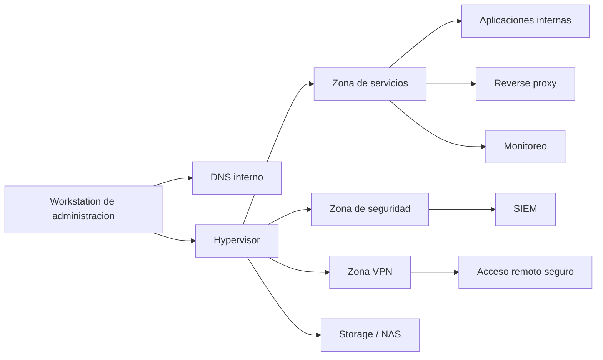

# 01 - Resumen Ejecutivo

## Objetivo

Este documento resume un homelab de forma ejecutiva y tecnica. La version publica busca mostrar criterio de arquitectura, operacion, seguridad y recuperacion sin exponer datos sensibles.

## Vision general

El homelab fue disenado como un entorno de practica para infraestructura, ciberseguridad y operacion diaria. La meta no es acumular servicios, sino demostrar capacidad para:

- disenar una arquitectura segmentada
- operar servicios con criterio
- reducir exposicion innecesaria
- centralizar resolucion interna
- observar el entorno con dashboards utiles
- respaldar y recuperar componentes criticos
- documentar decisiones, incidentes y limites

## Separacion publico / privado

| Capa | Proposito |
|---|---|
| Documentacion privada | operacion real, evidencias, incidentes, rutas, scripts, errores y datos criticos |
| Repositorio publico | version sanitizada para explicacion tecnica y revision de arquitectura |

La informacion operativa real no se copia directamente al repositorio publico. Primero se transforma en patrones, decisiones y aprendizajes sin datos identificables.

## Que demuestra este proyecto

| Capacidad | Como se refleja en el repo |
|---|---|
| Arquitectura | segmentacion por zonas, dependencias claras, publicacion controlada |
| Operacion | runbook, checks periodicos, diagnostico por escenario |
| Seguridad | minimo privilegio, administracion no expuesta, endurecimiento por rol |
| Observabilidad | separacion entre metricas operativas y visibilidad de seguridad |
| Continuidad | modelo de backup, estrategia offsite y restore como hito de madurez |
| Comunicacion tecnica | documentacion clara, sanitizada y defendible |

## Componentes principales

| Capa | Funcion |
|---|---|
| Hypervisor | virtualizacion, transito entre segmentos, punto de control central |
| DNS interno | resolucion centralizada y consistencia de acceso |
| Plataforma de aplicaciones | host para servicios internos |
| Seguridad | SIEM y telemetria de eventos |
| Monitoreo | metricas, dashboards y visibilidad operativa |
| Storage | repositorio de datos y nodo de backups |
| Acceso remoto | diseno de acceso seguro bajo modelo VPN |

## Estado actual resumido

### Resuelto

- segmentacion logica por zonas
- DNS interno centralizado
- plataforma de aplicaciones operativa
- observabilidad base operativa
- estrategia de backup y modelo offsite documentados
- enfoque de dashboards operativos, no decorativos
- documentacion publica separada de la documentacion privada

### En maduracion

- restore tests formales
- alertas operativas mas accionables
- evidencia SIEM para eventos criticos de backup
- redundancia DNS
- mejoras de acceso remoto bajo restricciones de conectividad
- hardening v2 por rol

## Topologia logica simplificada

## Estado canonico del proyecto

| Aspecto | Estado |
|---|---|
| Arquitectura | estable y documentada |
| Seguridad base | aplicada con enfoque por rol |
| Observabilidad | funcional y en mejora continua |
| Backups | operativos y documentados |
| Recuperacion | parcialmente demostrada; restore formal pendiente |
| Documentacion publica | sanitizada y tecnicamente defendible |

## Lectura correcta

Este homelab no busca parecer enterprise por decoracion. Busca mostrar algo mas serio:

> una infraestructura pequena, razonada, operable y explicable.
