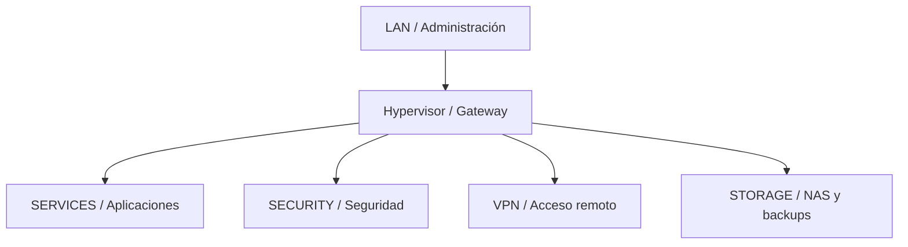
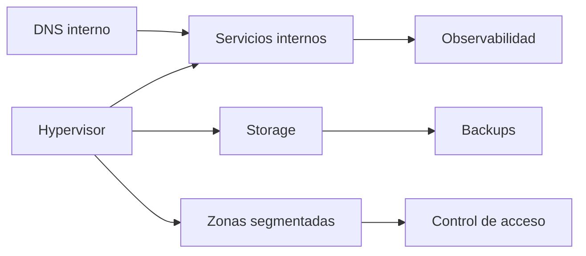

# 02 · Arquitectura y Red

## Propósito

Describir la arquitectura del homelab de manera clara, profesional y sanitizada.

## Principios de diseño

- segmentar por función
- evitar lateralidad innecesaria
- centralizar la administración
- no exponer servicios administrativos a Internet
- priorizar trazabilidad y mantenibilidad
- crecer por capas, no por improvisación

## Zonas lógicas

| Zona | Propósito |
|---|---|
| LAN | administración y acceso base |
| SERVICES | aplicaciones y servicios internos |
| SECURITY | seguridad, SIEM y telemetría |
| VPN | acceso remoto seguro |
| STORAGE | almacenamiento y backups |

## Modelo lógico de red

## Razonamiento arquitectónico

Dado que la capa física no está pensada para segmentación avanzada, el aislamiento lógico se implementa en el hypervisor.  
Eso convierte al host de virtualización en una pieza doblemente crítica:

- plataforma de cómputo
- punto de tránsito y control entre zonas

## Servicios por función

| Función | Ejemplo de familia tecnológica | Rol en el diseño |
|---|---|---|
| Virtualización | [hipervisor sanitizado] | host principal y núcleo de tránsito |
| DNS interno | [resolver DNS interno sanitizado] | resolución interna y consistencia de acceso |
| Plataforma de apps | [runtime de contenedores sanitizado] sobre VM | ejecución de servicios internos |
| Proxy | [reverse proxy sanitizado] | publicación controlada de servicios web |
| SIEM | [plataforma SIEM sanitizada] | visibilidad de eventos y seguridad |
| Monitoreo | [TSDB y capa de dashboards sanitizadas] | salud, métricas y dashboards |
| NAS | [solucion NAS sanitizada] | almacenamiento y soporte de backup |
| VPN | [VPN de tunel sanitizada] | diseño de acceso remoto seguro |

## Dependencias críticas

## Dependencias de primer orden

| Componente | Motivo |
|---|---|
| Hypervisor | concentra virtualización y tránsito |
| DNS interno | si falla, muchos servicios “parecen caídos” |
| Storage | impacta backups, retención y recuperación |
| Plataforma de apps | concentra servicios publicados y observabilidad |
| Rutas y NAT | afectan salida, reachability y coherencia del entorno |

## Publicación de servicios

Criterio general:

- acceso administrativo directo y controlado
- publicación web solo cuando tiene sentido
- servicios internos preferentemente por FQDN
- exposición externa evitada salvo diseño explícito

## Convencion de nombres

Modelo objetivo:

- nombres internos por rol
- prefijos o dominios separados por zona
- alias entendibles para servicios criticos

En el repositorio publico no se publica el naming real del entorno.

## Lectura profesional de la arquitectura

Esta arquitectura no compite por complejidad.  
Compite por claridad:

- cada zona tiene un propósito
- cada servicio tiene una razón
- cada dependencia importante está explícita
