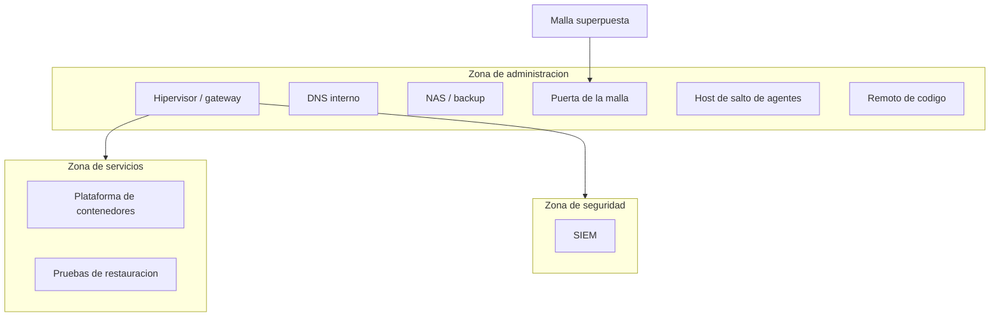

# 02 - Arquitectura y Red

> Estado descrito: septiembre de 2026.

## Proposito

Describir la arquitectura de la infraestructura de manera clara y sanitizada.

## Principios de diseno

- segmentar por funcion
- evitar lateralidad innecesaria
- centralizar la administracion
- ningun puerto entrante en el borde
- priorizar trazabilidad y mantenibilidad
- crecer por capas, no por improvisacion, y retirar lo que deja de usarse

## Zonas logicas

| Zona | Proposito |
|---|---|
| Administracion | hipervisor, DNS, NAS, remoto de codigo, puerta de la malla y host de salto |
| Servicios | contenedores, aplicaciones propias, observabilidad, proxy y la maquina de pruebas de restauracion |
| Seguridad | SIEM y telemetria |

**La zona de acceso remoto se retiro.** Existia para un tunel punto a punto que
necesitaba un puerto entrante. El acceso remoto actual no es una zona de red:
es una capa superpuesta al direccionamiento. Ver [03 - Seguridad y accesos](03-seguridad-y-accesos.md).

## Modelo logico de red

```mermaid
flowchart TB
    subgraph ADM[Zona de administracion]
        HV[Hipervisor / gateway]
        DNS[DNS interno]
        NAS[NAS / backup]
        GW[Puerta de la malla]
        JMP[Host de salto de agentes]
        GIT[Remoto de codigo]
    end
    subgraph SRV[Zona de servicios]
        CT[Plataforma de contenedores]
        DR[Pruebas de restauracion]
    end
    subgraph SEC[Zona de seguridad]
        SIEM[SIEM]
    end
    HV --> SRV
    HV --> SEC
    MALLA[Malla superpuesta] --> GW
```

## Razonamiento arquitectonico

La red fisica domestica no esta pensada para segmentacion avanzada, asi que el
aislamiento se implementa en el hipervisor. Eso lo vuelve doblemente critico:

- plataforma de computo
- punto de transito, NAT y control entre zonas

## Servicios por funcion

| Funcion | Familia tecnologica (conceptual) | Rol en el diseno |
|---|---|---|
| Virtualizacion | hipervisor open-source | host principal y nucleo de transito |
| DNS interno | resolver con filtrado | resolucion interna, servido por DHCP a toda la red |
| Plataforma de apps | runtime de contenedores sobre VM | aplicaciones propias y servicios internos |
| Proxy | proxy inverso gestionado | publicacion interna de servicios web |
| Remoto de codigo | forja git autoalojada con CI | repositorios propios y pipelines |
| SIEM | plataforma SIEM open-source | eventos, agentes y evidencia |
| Monitoreo | TSDB de metricas + capa de dashboards y alertas | salud, frescura y avisos |
| NAS | solucion NAS open-source | backups, espejo de la estacion y copia fuera del sitio |
| Recuperacion | VM dedicada en la zona de servicios | restauraciones de prueba efimeras, en una instancia que nunca se publica |
| Acceso remoto | malla superpuesta con identidad por nodo | acceso sin puertos entrantes |
| Acceso automatizado | VM de salto | unico camino de los agentes de IA |

## Dependencias de primer orden

| Componente | Motivo |
|---|---|
| Hipervisor | concentra virtualizacion, transito y recuperacion |
| DNS interno | si falla, muchos servicios parecen caidos |
| Storage | impacta backups, retencion y recuperacion |
| Plataforma de contenedores | concentra apps, proxy y observabilidad |
| Puerta de la malla | es el unico acceso desde fuera del sitio |

## Orden de arranque

Las maquinas arrancan por orden de dependencia: primero DNS, despues la puerta
de la malla y el storage, despues la plataforma de contenedores. Un reinicio real
del hipervisor mostro que **el arranque escalonado se corto antes de llegar a
las ultimas dos maquinas**, aunque la configuracion decia que debian arrancar.
La configuracion leida sola parecia resuelta; el reinicio mostro que no. Queda
como riesgo abierto hasta confirmar la causa.

## Publicacion de servicios

- acceso administrativo directo y controlado
- servicios internos por nombre, a traves del proxy
- aplicaciones propias solo alcanzables por tunel, nunca publicadas
- ninguna exposicion externa

## Convencion de nombres

Nombres internos por rol, dominios separados por zona y alias entendibles para
los servicios criticos. En el repositorio publico no se publica el naming real.

## Lectura de la arquitectura

Esta arquitectura no compite por complejidad. Compite por claridad:

- cada zona tiene un proposito
- cada servicio tiene una razon
- cada dependencia importante esta explicita
- lo que dejo de tener razon se retiro: un tunel VPN, una consola NOC, un
  canal de chat de alertas y varios servicios de IA local
