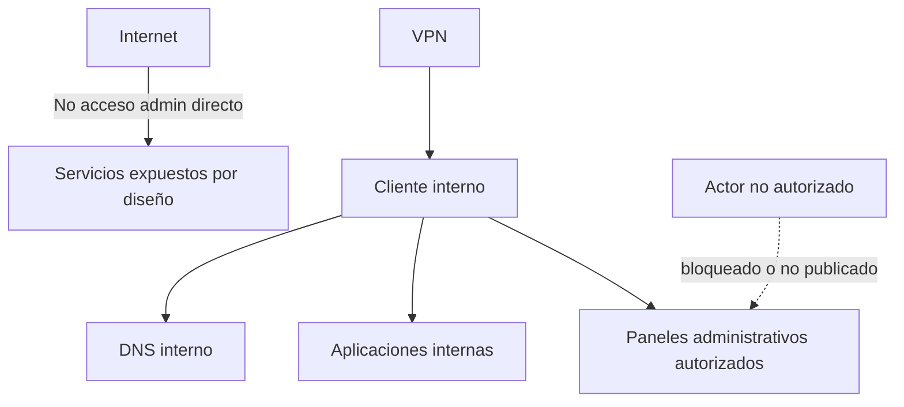

# 03 · Seguridad y Accesos

## Propósito

Documentar el enfoque de seguridad del homelab sin exponer detalles sensibles.

## Modelo de seguridad

El entorno sigue un modelo pequeño pero explícito:

- segmentación por rol
- mínimo privilegio
- reducción de lateralidad
- administración no expuesta públicamente
- acceso remoto detrás de VPN
- excepciones documentadas cuando un flujo entre zonas es necesario

## Principios aplicados

| Principio | Aplicación |
|---|---|
| Mínimo privilegio | accesos administrativos controlados |
| Segmentación | separación de zonas con propósito |
| Seguridad por diseño | servicios críticos no expuestos |
| Excepciones documentadas | flujos permitidos solo por necesidad funcional |
| Hardening por rol | no todos los hosts reciben el mismo tratamiento |

## Qué no se publica en este repo

- claves privadas
- secretos
- tokens
- credenciales
- endpoints reales de administración
- configuración completa de VPN
- detalles sensibles del sistema de backup offsite

## Accesos

### Acceso administrativo

- acceso directo solo desde origen autorizado
- prioridad a SSH y paneles internos bajo control
- sin publicación directa a Internet de interfaces administrativas

### Acceso de aplicaciones

- preferencia por FQDN interno
- reverse proxy para servicios web seleccionados
- puertos directos solo cuando existe justificación operativa

### Acceso remoto

- modelo basado en VPN
- publicación externa solo bajo diseño controlado
- consideración explícita de restricciones de conectividad y CGNAT

## Hardening por rol

Una lección importante del proyecto es que **un hardening genérico no sirve para todos los hosts**.

| Tipo de host | Enfoque recomendado |
|---|---|
| DNS interno | permitir puertos funcionales de resolución y administración mínima |
| NAS / storage | proteger SMB y acceso web según origen |
| SIEM | exponer solo puertos requeridos para dashboard y agentes |
| [host de contenedores] | tratamiento especial por interacción con networking y proxy |
| Hypervisor | control fino de firewall, forwarding y tránsito |

## Flujos legítimos entre zonas

Hay casos donde una zona debe hablar con otra.  
Eso no contradice la segmentación; la vuelve realista.

Criterio:

- permitir solo el flujo necesario
- documentar por qué existe
- validar impacto operativo
- revisarlo periódicamente

## Riesgos conocidos

| Riesgo | Mitigación actual | Pendiente |
|---|---|---|
| Punto único de falla DNS | DNS interno central | redundancia DNS |
| Acceso remoto limitado por conectividad | diseño VPN local | relay / VPS o mejora de salida |
| Recuperación no completamente demostrada | backups y DRP documentados | restore test real |
| Complejidad creciente | runbook y documentación | revisión continua de alcance |

## Threat model lite

## Idea central

La seguridad de este homelab no se apoya en una sola herramienta.  
Se apoya en una combinación de:

- segmentación
- publicación controlada
- endurecimiento según rol
- operación disciplinada
- documentación clara
