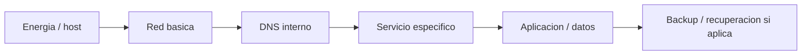

# 04 - Runbook Operativo

> Estado descrito: septiembre de 2026.

## Proposito

Resumir como se opera la infraestructura sin exponer detalles sensibles. No reemplaza la
documentacion interna; es su version presentable.

## Como se opera en la practica

El entorno lo opera una sola persona, asi que la revision diaria manual no escala.
El modelo es:

- **las alertas avisan solo cuando algo fallo, no se hizo o dejo de pasar.**
  Nada de confirmaciones de que todo esta bien: ensenan a ignorar el canal;
- los dashboards se miran cuando uno quiere mirar, no para enterarse de fallos;
- una revision semanal cubre lo que ninguna alerta mide;
- cada sesion de trabajo arranca leyendo el estado de cierre de la anterior y
  **vuelve a medir** lo que va a afirmar: un estado escrito ayer ya puede estar
  vencido.

## Orden de diagnostico

## Revision semanal

| Control | Resultado esperado |
|---|---|
| espacio en storage | por encima del umbral que decide si el backup corre |
| backups y copia fuera del sitio | contenido reciente, no solo archivo reciente |
| pruebas de restauracion | ultima corrida reciente y exitosa |
| parches | sin reinicios pendientes acumulados |
| maquinas del hipervisor | todas en el estado esperado despues del ultimo reinicio |
| pendientes criticos | revisados contra el entorno real |
| documentacion publica | sin datos sensibles |

## Escenarios operativos tipicos

### 1. No responde un servicio web

1. resolucion de nombre
2. alcance por red
3. estado de la VM o del contenedor
4. proxy o publicacion
5. logs del servicio, **acotados al ultimo arranque**
6. dependencia de storage o DNS

### 2. Falla DNS interno

1. estado del servicio
2. puertos de escucha
3. cliente apuntando al resolver correcto
4. resolucion desde un origen confiable
5. impacto sobre servicios dependientes

### 3. Problema de conectividad entre zonas

1. gateway de la zona
2. reenvio
3. NAT
4. reglas permitidas entre zonas
5. diferencia entre problema de DNS y problema de transito

### 4. Storage lleno o backups fallando

1. espacio libre, **en el anfitrion y no solo dentro de la VM**
2. instantaneas que retienen bloques viejos
3. crecimiento por dominio y residuos
4. politica de retencion
5. integridad del ultimo backup bueno
6. estado de la copia fuera del sitio

### 5. Acceso remoto parcial

1. estado del nodo en la malla
2. rutas anunciadas **y aprobadas**
3. politica de la malla para ese origen y puerto
4. salida a internet incluida en la lista de rutas
5. que la red local no este capturando la ruta por especificidad

### 6. Dashboard o alerta inconsistente

1. fuente de metricas y exportador
2. scrape o ingesta
3. dashboard y query
4. **si la metrica mide el resultado o solo que un paso corrio**

## Matriz rapida de decision

| Sintoma | Primera sospecha |
|---|---|
| por direccion funciona, por nombre no | DNS |
| varios servicios caidos a la vez | hipervisor o red |
| backup "reciente" con contenido viejo | un eslabon anterior de la cadena |
| borrar no libera espacio | una instantanea |
| acceso remoto parcial | rutas anunciadas, politica de la malla o ruta local |
| alerta que nunca llega | la ruta de aviso, no la deteccion |
| dashboard verde con servicio roto | la metrica mide otra cosa |

## Cambios y borrados

- todo cambio sale de un commit y de un bloque verificable; produccion no se
  edita a mano
- todo paso destructivo necesita una copia **verificada abriendola**
- **nada se borra directo**: va a una cuarentena de treinta dias con manifiesto
- los repositorios se borran solo si su contenido esta integro en otro,
  verificado commit a commit; si no, se archivan
- rollback cuando el cambio reciente es claramente el origen y volver cuesta
  menos que seguir tocando

## Rearmar la estacion de trabajo

La estacion de trabajo del operador tiene su propio procedimiento, probado en
una maquina limpia con las mismas dos cuentas que el equipo real:

1. antes: respaldo cifrado, captura de configuracion y verificacion de que todo
   repositorio tiene remoto al dia;
2. despues: instalacion como administrador, restauracion como usuario sin
   privilegios, y registro de tareas otra vez como administrador;
3. el procedimiento esta escrito para seguirse **sin asistencia**, incluidas las
   fallas conocidas y como salir de cada una.

Detalle en [Caso 07](casos-de-estudio/07-migracion-de-workstation-y-respaldos-que-mentian.md).

## Lecciones operativas incorporadas

- una instantanea no reemplaza un backup, y ademas retiene espacio
- un backup generado no equivale a un backup con datos nuevos
- una tarea ejecutada no equivale a una tarea validada
- una configuracion leida no equivale a un comportamiento observado
- una caida de SSH no prueba un reinicio: se confirma con el tiempo de arranque
- si no esta validado, no existe
