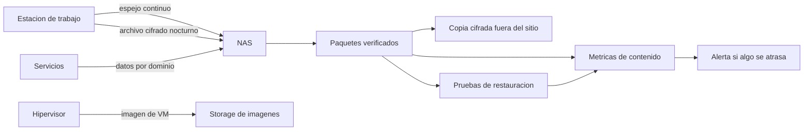

# 05 - Backup y Recuperacion

> Estado descrito: septiembre de 2026.

## Proposito

Describir la estrategia de backup y recuperacion de la infraestructura.

## Principios

- recuperar vale mas que tener una copia
- **un backup se mide por la edad de su contenido, no por la de su archivo**
- instantanea y backup no son lo mismo
- una copia fuera del sitio sin restauracion probada no alcanza
- una falla de backup tiene que avisar sola
- el material para descifrar o restaurar tambien es critico, y no vive solo
  dentro del sistema que recupera

## Capas del modelo

| Capa | Que cubre |
|---|---|
| Imagen de VM | rollback de maquinas completas |
| Datos por dominio | configuraciones y datos de servicios, empaquetados y verificados por hash |
| Espejo de la estacion de trabajo | sincronizacion continua del disco de datos hacia el NAS |
| Respaldo de configuracion de la estacion | archivo cifrado nocturno del perfil de trabajo |
| Remoto de codigo | historial completo de los repositorios, en el mismo sitio |
| Copia fuera del sitio | copia cifrada de los dominios criticos |
| Pruebas de restauracion | evidencia de que la recuperacion es real |
| Evidencia | metricas, eventos y alertas |

## Flujo logico

## La cadena que se corto sin avisar

En 2026 se descubrio que el respaldo de la estacion de trabajo llevaba casi
cuatro meses congelado. La cadena tenia cinco eslabones; se corto en el primero
y los otros cuatro siguieron corriendo. **La metrica media la edad del archivo
comprimido, no la de su contenido**, asi que informaba un respaldo de pocas horas.

Se reemplazo por un esquema mas simple, y el principio quedo escrito: la
metrica tiene que medir **lo que el respaldo contiene**. Detalle en
[Caso 07](casos-de-estudio/07-migracion-de-workstation-y-respaldos-que-mentian.md).

## Ventana y umbrales

- los backups corren en una ventana de baja actividad, despues del parcheo
- **si el storage no tiene el espacio minimo, el backup no corre** y la falla
  se ve; es preferible a llenar el disco a mitad de la noche
- las metricas se refrescan despues de que la ventana deberia haber terminado
- la pregunta que responden: *puedo operar hoy con confianza?*

## Respaldo con archivos abiertos

Parte de lo que se respalda pertenece a herramientas que nunca se cierran. El
criterio, definido por el dueno del equipo: **perder unas horas es aceptable;
restaurar algo de hace meses creyendo que es de ayer, no.**

- los archivos abiertos se leen en modo compartido;
- las bases de datos incluidas se comprueban extrayendolas del respaldo;
- un respaldo incompleto se marca como tal y **no renueva la metrica de exito**.

## Copia fuera del sitio

- el contenido esta cifrado
- las claves de recuperacion viven fuera del sistema que se recupera
- no se publican destinos, rutas ni configuraciones
- su frescura tiene metrica y alerta propias

**Leccion de 2026:** la copia fuera del sitio fallo varios dias seguidos sin
alerta. El script terminaba con un codigo de salida explicito, y la trampa de
errores que debia avisar no se dispara en ese caso. El aviso ahora se engancha a
la salida del proceso, que ocurre siempre.

## Pruebas de restauracion

Se ejecutan en una maquina dedicada, separada de produccion. **La validacion no
guarda credenciales**: en vez de un inicio de sesion real se valida:

- integridad del paquete (hash), de la base de datos y conteos esperados
- arranque real del servicio desde el backup, en una instancia que escucha solo
  en la interfaz local y nunca se publica
- estructura valida del vault documental, sin abrir su contenido en vivo

Propiedades:

- datos restaurados efimeros, borrados al terminar cada corrida
- acceso al backup por un canal restringido que solo entrega el ultimo paquete
- la evidencia guarda conteos y metadatos, nunca contenido
- cada corrida publica **RTO y RPO** como metricas

Resultados medidos: el servicio chico se recupera en **segundos** y el dominio
documental en **menos de dos minutos**, dominado por el tamano del paquete.

**Estado honesto:** las pruebas funcionaron y siguen dando exito, pero **su
corrida periodica se interrumpio durante la migracion de septiembre**, y nada
aviso: ninguna alerta miraba si la prueba dejaba de correr. La
causa esta por confirmar, y la regla que falta es una alerta por *prueba de
restauracion atrasada*. Se detecto al actualizar esta documentacion.

## Distincion clave

| Concepto | Uso correcto |
|---|---|
| Instantanea | rollback rapido antes de un cambio; se crea con fecha de retiro |
| Backup | recuperacion portable |
| Copia fuera del sitio | resiliencia ante perdida local |
| Remoto de codigo en el mismo sitio | historial y colaboracion; **no** es una copia fuera del sitio |
| Prueba de restauracion | evidencia de que la recuperacion es real |
| Alerta | senal accionable, no reemplazo de la validacion |

## Escenarios de recuperacion

| Escenario | Camino |
|---|---|
| Falla de servicio | validar DNS, red y storage; restaurar el dominio; confirmar salud |
| Falla de VM | rollback por instantanea o imagen; validar arranque y alcance |
| Perdida parcial de storage | aislar; recuperar desde paquete local o copia externa |
| Perdida de la estacion de trabajo | procedimiento de rearmado probado en maquina limpia |
| Perdida amplia | plataforma base, DNS, storage, servicios por prioridad |

## Prioridad de recuperacion

| Prioridad | Componente |
|---|---|
| Alta | hipervisor, DNS interno, storage, puerta de la malla, plataforma de apps |
| Alta | datos y configuracion de servicios criticos, remoto de codigo |
| Media | observabilidad y dashboards |
| Variable | servicios auxiliares o de prueba |

## Riesgos abiertos

| Riesgo | Estado |
|---|---|
| corrida periodica de las pruebas de restauracion | interrumpida; reanudar y alertar por atraso |
| respaldo de imagen de todas las VMs | parcial: algunas maquinas solo respaldan datos |
| copia fuera del sitio del remoto de codigo | pendiente, a medio externo |
| redundancia fisica de storage | un disco de soporte fallo; reemplazo postergado |

## Idea central

> conciencia de recuperacion, medida por contenido y probada restaurando.
