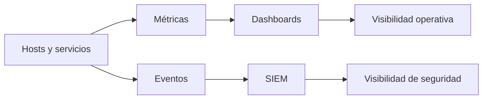
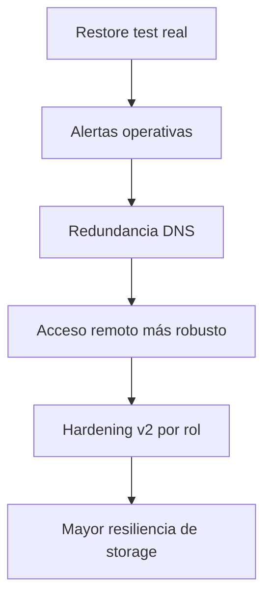

# 06 · Observabilidad y Roadmap

## Propósito

Explicar cómo se observa el entorno y hacia dónde evoluciona.

## Separación conceptual

Este homelab separa dos cosas que muchas veces se mezclan:

| Capa | Propósito |
|---|---|
| Observabilidad de infraestructura | salud, recursos, disponibilidad, performance |
| Visibilidad de seguridad | eventos, agentes, telemetría, investigación |

## Stack lógico

## Qué busca responder la observabilidad

- qué está caído
- qué está degradado
- qué cambió
- qué servicio consume más recursos
- qué dependencia crítica dejó de responder
- qué incidente requiere atención inmediata

## Valor real

La observabilidad del proyecto no está para decorar dashboards.  
Está para operar mejor y diagnosticar más rápido.

## Estado actual

### Resuelto

- métricas base
- dashboards de infraestructura
- visibilidad de seguridad inicial
- diferenciación entre monitoreo y seguridad
- documentación pública del enfoque

### Pendiente

- alertas más accionables
- paneles más ejecutivos
- monitoreo más fino de storage y red
- mejor integración de eventos críticos

## Roadmap priorizado

## Backlog ordenado

| Prioridad | Ítem | Motivo |
|---|---|---|
| Crítica | Restore test real | cerrar la brecha entre backup y recuperación |
| Alta | Alertas operativas | reducir tiempo de reacción |
| Alta | Redundancia DNS | bajar punto único de falla |
| Alta | Acceso remoto más robusto | resolver limitaciones de conectividad |
| Media | Hardening v2 por rol | madurar controles sin romper operación |
| Media | Mejora de storage | resiliencia y capacidad |
| Media | Dashboards más ejecutivos | lectura más rápida en operación |

## Lectura correcta del roadmap

El siguiente paso del proyecto no es “agregar más cosas”.  
Es cerrar mejor lo ya importante:

- recuperar
- alertar
- resistir mejor fallos
- operar con más confianza

## Conclusión

La observabilidad y el roadmap muestran madurez técnica cuando dejan claro esto:

- qué ya funciona
- qué todavía es frágil
- qué se prioriza
- por qué
