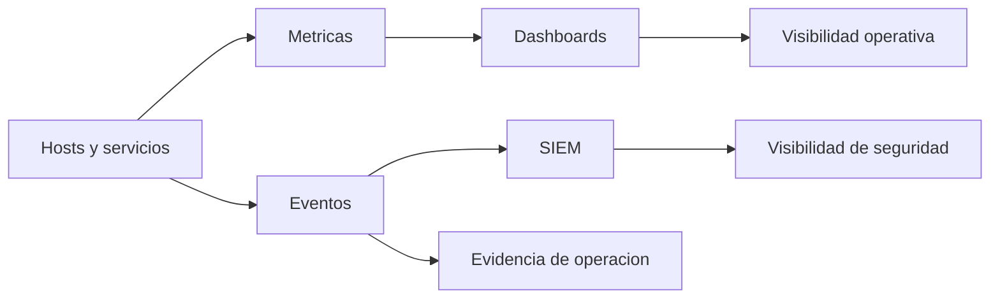
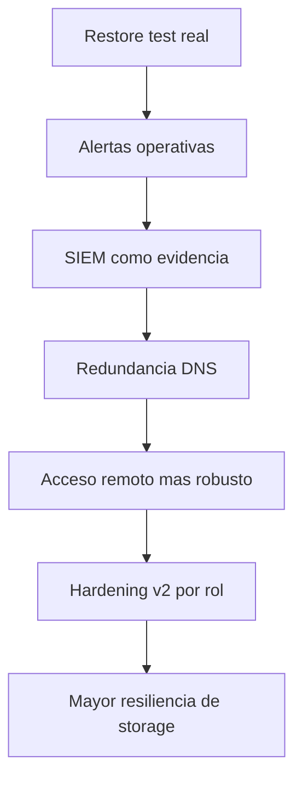

# 06 - Observabilidad y Roadmap

## Proposito

Explicar como se observa el entorno y hacia donde evoluciona.

## Separacion conceptual

Este homelab separa tres capas que muchas veces se mezclan:

| Capa | Proposito |
|---|---|
| Observabilidad de infraestructura | salud, recursos, disponibilidad, performance |
| Visibilidad de seguridad | eventos, agentes, telemetria, investigacion |
| Evidencia operativa | pruebas de que backups, alertas y controles funcionaron |

## Stack logico

## Que busca responder la observabilidad

- que esta caido
- que esta degradado
- que cambio
- que servicio consume mas recursos
- que dependencia critica dejo de responder
- que incidente requiere atencion inmediata
- que backup o copia offsite fallo o quedo fuera de ventana

## Valor real

La observabilidad del proyecto no esta para decorar dashboards. Esta para operar mejor y diagnosticar mas rapido.

## Dashboards operativos

Los dashboards se disenan para responder preguntas concretas:

- salud general del entorno
- disponibilidad de servicios principales
- estado de backups y offsite
- presion de storage
- senales relevantes para una pantalla NOC o vista de operaciones

Regla publica:

- no publicar JSON real de dashboards si contiene rutas, hosts o queries sensibles
- documentar el objetivo y el criterio de diseno
- mantener backups privados del JSON antes/despues de cambios

## SIEM como evidencia

El SIEM se usa como capa de seguridad y evidencia operativa. Ejemplos publicos de uso:

- elevar fallos de backup a alertas de severidad alta
- detectar agentes desconectados
- conservar eventos relevantes para auditoria tecnica
- separar alerta tactica de evidencia historica

La version publica no incluye reglas reales, IDs, paths, eventos JSON ni nombres de agentes.

## Estado actual

### Resuelto

- metricas base
- dashboards de infraestructura
- visibilidad de seguridad inicial
- diferenciacion entre monitoreo y seguridad
- documentacion publica del enfoque
- separacion entre documentacion privada y publica

### En maduracion

- alertas mas accionables
- paneles mas ejecutivos
- monitoreo mas fino de storage y red
- mejor integracion de eventos criticos
- restore tests como evidencia de recuperacion

## Roadmap priorizado

## Backlog ordenado

| Prioridad | Item | Motivo |
|---|---|---|
| Critica | Restore test real | cerrar la brecha entre backup y recuperacion |
| Alta | Alertas operativas | reducir tiempo de reaccion |
| Alta | Evidencia SIEM de backups | demostrar fallos y estado con trazabilidad |
| Alta | Redundancia DNS | bajar punto unico de falla |
| Alta | Acceso remoto mas robusto | resolver limitaciones de conectividad |
| Media | Hardening v2 por rol | madurar controles sin romper operacion |
| Media | Mejora de storage | resiliencia y capacidad |
| Media | Dashboards mas ejecutivos | lectura mas rapida en operacion |

## Lectura correcta del roadmap

El siguiente paso del proyecto no es agregar mas cosas. Es cerrar mejor lo ya importante:

- recuperar
- alertar
- evidenciar
- resistir mejor fallos
- operar con mas confianza

## Conclusion

La observabilidad y el roadmap muestran madurez tecnica cuando dejan claro esto:

- que ya funciona
- que todavia es fragil
- que se prioriza
- por que
