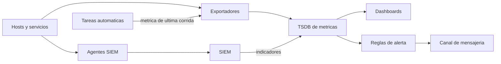
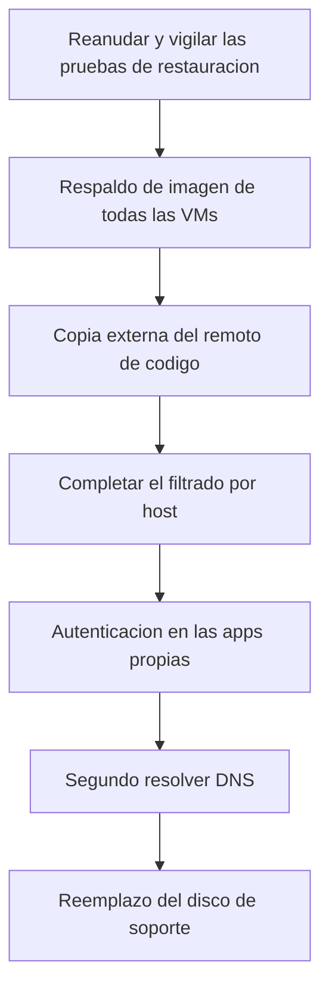

# 06 - Observabilidad y Roadmap

> Estado descrito: septiembre de 2026.

## Proposito

Explicar como se observa el entorno, como avisa y hacia donde evoluciona.

## Separacion conceptual

| Capa | Proposito |
|---|---|
| Observabilidad de infraestructura | salud, recursos, disponibilidad |
| Visibilidad de seguridad | eventos, agentes, telemetria |
| Evidencia operativa | pruebas de que backups, parches y controles funcionaron |
| Alertas | aviso de lo que fallo, no se hizo o dejo de pasar |

## Stack logico

```mermaid
flowchart LR
    A[Hosts y servicios] --> B[Exportadores]
    T[Tareas automaticas] -->|metrica de ultima corrida| B
    B --> C[TSDB de metricas]
    C --> D[Dashboards]
    C --> R[Reglas de alerta]
    R --> M[Canal de mensajeria]
    A --> E[Agentes SIEM]
    E --> S[SIEM]
    S -->|indicadores| C
```

## Que se mide

- disponibilidad de hosts y servicios, por sondas de red, HTTP y DNS
- recursos del hipervisor y de los contenedores
- frescura y resultado de cada dominio de backup y de la copia fuera del sitio
- edad del respaldo nocturno de la estacion de trabajo
- pruebas de restauracion: resultado, RTO y RPO
- parches pendientes, reinicios pendientes y ultima corrida del parcheo
- actualizaciones de contenedores, fallidas y revertidas
- estado de la malla de acceso remoto y de su auditoria
- indicadores del SIEM: agentes activos y alertas de alta severidad
- si el host de salto de los agentes esta encendido

**Regla:** toda tarea automatica deja una metrica con la hora de su ultima
corrida exitosa. Sin esa metrica, una tarea que deja de correr es invisible.

## Alertas

Las alertas salen de la capa de dashboards hacia un canal de mensajeria. Solo
hay tres formas validas:

| Forma | Ejemplo |
|---|---|
| Algo fallo | un exportador caido, una sonda que no responde |
| Algo no se hizo | backup atrasado, parches sin aplicar, reinicio pendiente |
| Algo dejo de pasar | la auditoria de la malla muda, un indicador sin actualizar |

**Prohibido en el canal:** confirmaciones, resumenes diarios, "backup
completado". Ensenan a ignorar el telefono. Los avisos de *resuelta* se
conservan porque cierran un aviso que ya se mando.

Las reglas no tienen rutas condicionales: ninguna alerta se pierde por no
coincidir con un filtro.

**Historia:** el primer canal de alertas fue un chat que nunca llego a entregar
nada; durante meses **ninguna alerta llegaba a ningun lado**, y las reglas se
evaluaban igual. Se reemplazo por un canal de mensajeria con integracion nativa.
La leccion: una alerta sin destino verificado no es una alerta.

## Dashboards

Se disenan para responder preguntas concretas: salud general, estado de backups
y copia fuera del sitio, presion de storage, parches y acceso remoto.

- no se publica el JSON real de los dashboards
- se documenta el objetivo de cada uno
- los cambios se respaldan antes y despues

La consola dedicada a mostrar dashboards en una pantalla se dio de baja: el
aviso por mensajeria la volvio innecesaria.

## SIEM como evidencia

- los fallos de backup se elevan a eventos de severidad alta
- los agentes desconectados se detectan
- la alerta tactica se separa de la evidencia historica

La version publica no incluye reglas, identificadores ni eventos.

## Estado actual

### Funcionando

- metricas de todos los hosts de infraestructura y sondas de disponibilidad
- alertas de fallo al canal de mensajeria
- metricas de contenido para los backups y la copia fuera del sitio
- metricas de parcheo y de actualizacion de contenedores
- auditoria de la malla con alerta por silencio
- indicadores del SIEM integrados al monitoreo

### En maduracion

- alerta por prueba de restauracion **atrasada**, no solo fallida
- ruido del SIEM: la gran mayoria de sus alertas son de baja severidad
- ingestion de la auditoria del sistema en el SIEM
- dashboards mas legibles para una revision rapida

## Roadmap priorizado

```mermaid
flowchart TD
    A[Reanudar y vigilar las pruebas de restauracion] --> B[Respaldo de imagen de todas las VMs]
    B --> C[Copia externa del remoto de codigo]
    C --> D[Completar el filtrado por host]
    D --> E[Autenticacion en las apps propias]
    E --> F[Segundo resolver DNS]
    F --> G[Reemplazo del disco de soporte]
```

## Backlog ordenado

| Prioridad | Item | Motivo |
|---|---|---|
| Alta | Pruebas de restauracion con alerta por atraso | hoy pueden dejar de correr sin aviso |
| Alta | Arranque confiable de todas las VMs | un reinicio real dejo dos maquinas apagadas |
| Alta | Respaldo de imagen para todas las VMs | algunas solo respaldan datos |
| Alta | Copia externa del remoto de codigo | un remoto en el mismo sitio no es copia fuera del sitio |
| Media | Completar filtrado por host | cerrar la brecha medida |
| Media | Autenticacion en las apps propias | no depender solo del tunel |
| Media | Segundo resolver DNS | punto unico de falla |
| Media | Reducir ruido del SIEM | senal util sobre volumen |
| Baja | Reemplazo del disco de soporte | postergado por presupuesto |

## Lectura correcta del roadmap

El siguiente paso no es agregar herramientas. Es cerrar mejor lo importante:
recuperar, alertar, evidenciar y resistir fallos.

## Conclusion

La observabilidad demuestra madurez cuando deja claro:

- que ya funciona
- que todavia es fragil
- que se prioriza y por que
- y que cada cosa que dejo de correr **lo avisa sola**
